

# BÁO CÁO BÀI TẬP LỚN

## HỆ THỐNG QUẢN LÝ NHÂN SỰ DOANH NGHIỆP

### (HRMS - Human Resource Management System)

---

**Môn học:** Công Nghệ Phần Mềm

**Giảng viên hướng dẫn:** _[Tên Giảng Viên]_

**Sinh viên thực hiện:** _[Tên Sinh Viên]_

**MSSV:** _[Mã Số Sinh Viên]_

**Lớp:** _[Tên Lớp]_

---

**Năm học 2025 - 2026**

---

# MỤC LỤC

1. [Lời Mở Đầu](#1-lời-mở-đầu)
2. [Giới Thiệu Đề Tài](#2-giới-thiệu-đề-tài)
3. [Phân Tích Yêu Cầu](#3-phân-tích-yêu-cầu)
4. [Kiến Trúc Hệ Thống (System Architecture Diagram)](#4-kiến-trúc-hệ-thống-system-architecture-diagram)
5. [Mô Hình Kiến Trúc 3 Tầng (Three-Layer Architecture Model)](#5-mô-hình-kiến-trúc-3-tầng-three-layer-architecture-model)
6. [Biểu Đồ Use Case Tổng Quát](#6-biểu-đồ-use-case-tổng-quát)
7. [Đặc Tả Use Case Chi Tiết (Detailed UseCase)](#7-đặc-tả-use-case-chi-tiết-detailed-usecase)
8. [Biểu Đồ Lớp (Class Diagram)](#8-biểu-đồ-lớp-class-diagram)
9. [Biểu Đồ Quan Hệ (Relationship Diagram)](#9-biểu-đồ-quan-hệ-relationship-diagram)
10. [Biểu Đồ ERD (Entity-Relationship Diagram)](#10-biểu-đồ-erd-entity-relationship-diagram)
11. [Thiết Kế Cơ Sở Dữ Liệu (Database)](#11-thiết-kế-cơ-sở-dữ-liệu-database)
12. [Biểu Đồ Gói (Package Diagram)](#12-biểu-đồ-gói-package-diagram)
13. [Biểu Đồ Tuần Tự (Sequence Diagram)](#13-biểu-đồ-tuần-tự-sequence-diagram)
14. [Biểu Đồ Hoạt Động (Activity Diagram)](#14-biểu-đồ-hoạt-động-activity-diagram)
15. [Biểu Đồ Trạng Thái (State Machine Diagram)](#15-biểu-đồ-trạng-thái-state-machine-diagram)
16. [Biểu Đồ Triển Khai (Deployment Diagram)](#16-biểu-đồ-triển-khai-deployment-diagram)
17. [Công Nghệ Sử Dụng](#17-công-nghệ-sử-dụng)
18. [Kết Quả Đạt Được](#18-kết-quả-đạt-được)
19. [Tổng Kết](#19-tổng-kết)
20. [Tài Liệu Tham Khảo](#20-tài-liệu-tham-khảo)

---

# 1. Lời Mở Đầu

Trong bối cảnh chuyển đổi số đang diễn ra mạnh mẽ tại các doanh nghiệp Việt Nam, việc quản lý nhân sự truyền thống bằng giấy tờ và bảng tính Excel đã bộc lộ nhiều hạn chế nghiêm trọng: tốn thời gian, dễ sai sót, khó tra cứu và không đảm bảo tính bảo mật. Một hệ thống quản lý nhân sự (HRMS) hiện đại, ứng dụng công nghệ web là giải pháp tất yếu để nâng cao hiệu quả vận hành.

Bài tập lớn này xây dựng **Hệ Thống Quản Lý Nhân Sự Doanh Nghiệp (HRMS)** — một ứng dụng web full-stack hoàn chỉnh, bao gồm các chức năng cốt lõi: quản lý hồ sơ nhân viên, chấm công, đơn xin nghỉ phép, hợp đồng lao động, tính lương theo quy định thuế TNCN Việt Nam, quản lý bảo hiểm, và báo cáo thống kê trực quan. Hệ thống được thiết kế với kiến trúc Client-Server hiện đại, phân quyền 3 cấp (HRMO, Trưởng Phòng, Nhân Viên), đảm bảo tính bảo mật và linh hoạt.

Thông qua đề tài này, em mong muốn áp dụng kiến thức đã học về Công nghệ Phần mềm vào thực tiễn: từ phân tích yêu cầu, thiết kế hệ thống bằng UML, đến lập trình và triển khai ứng dụng hoàn chỉnh.

---

# 2. Giới Thiệu Đề Tài

## 2.1. Tên đề tài
**Hệ Thống Quản Lý Nhân Sự Doanh Nghiệp (HRMS - Human Resource Management System)**

## 2.2. Mục tiêu
- Xây dựng hệ thống web quản lý nhân sự toàn diện cho doanh nghiệp vừa và nhỏ tại Việt Nam.
- Tự động hóa các quy trình: chấm công, xin nghỉ phép, tính lương, quản lý hợp đồng và bảo hiểm.
- Cung cấp dashboard trực quan với biểu đồ thống kê real-time.
- Phân quyền 3 cấp đảm bảo bảo mật và đúng nghiệp vụ.
- Hỗ trợ xuất dữ liệu ra file Excel cho báo cáo.

## 2.3. Phạm vi
| Thành phần | Mô tả |
|---|---|
| **Đối tượng sử dụng** | HRMO (Admin), Trưởng Phòng (Manager), Nhân Viên (Employee) |
| **Các module chính** | Xác thực, Nhân viên, Phòng ban, Vị trí, Chấm công, Nghỉ phép, Hợp đồng, Lương, Bảo hiểm, Dashboard, Sơ đồ tổ chức |
| **Nền tảng** | Ứng dụng web (Desktop & Mobile responsive) |
| **Quy mô** | Doanh nghiệp vừa và nhỏ (50-500 nhân viên) |

## 2.4. Các vai trò trong hệ thống

| Vai trò | Mô tả | Quyền hạn chính |
|---|---|---|
| **HRMO (Admin)** | Quản trị toàn bộ hệ thống | CRUD tất cả dữ liệu, duyệt chấm công/nghỉ phép của Manager, quản lý cấu hình |
| **Trưởng Phòng (Manager)** | Quản lý nhân viên trong phòng | Duyệt chấm công và đơn nghỉ phép của nhân viên, xem dữ liệu phòng ban |
| **Nhân Viên (Employee)** | Tự phục vụ | Chấm công, tạo đơn xin nghỉ, xem thông tin cá nhân, lương, hợp đồng |

---

# 3. Phân Tích Yêu Cầu

## 3.1. Yêu cầu chức năng

| STT | Module | Chức năng | Mô tả |
|---|---|---|---|
| 1 | Xác thực | Đăng nhập / Đăng xuất | Xác thực bằng email & mật khẩu, JWT token (24h), tự động redirect khi chưa đăng nhập |
| 2 | Nhân viên | CRUD Nhân viên | Thêm/sửa/xóa/xem hồ sơ nhân viên đầy đủ (thông tin cá nhân, ngân hàng, CCCD, thuế) |
| 3 | Nhân viên | Sơ đồ tổ chức | Hiển thị cây tổ chức phòng ban - nhân viên |
| 4 | Phòng ban | CRUD Phòng ban | Quản lý cấu trúc phòng ban phân cấp, gán trưởng phòng |
| 5 | Vị trí | CRUD Vị trí | Quản lý chức danh, mức lương cơ bản theo vị trí |
| 6 | Chấm công | Check-in / Check-out | Ghi nhận giờ vào/ra, tự động tính đi muộn/về sớm (so với 08:30-17:30) |
| 7 | Chấm công | Duyệt chấm công | Trưởng phòng duyệt/từ chối chấm công của nhân viên |
| 8 | Nghỉ phép | Tạo đơn xin nghỉ | Chọn loại nghỉ, ngày bắt đầu/kết thúc, nhập lý do |
| 9 | Nghỉ phép | Duyệt đơn nghỉ | Trưởng phòng duyệt/từ chối, tự động trừ ngày phép |
| 10 | Hợp đồng | CRUD Hợp đồng | Soạn hợp đồng với rich text editor (TipTap), quản lý trạng thái |
| 11 | Lương | Tính lương hàng tháng | Tự động tính gross → net theo biểu thuế TNCN lũy tiến 7 bậc Việt Nam |
| 12 | Lương | Duyệt & Thanh toán | Quy trình draft → approved → paid |
| 13 | Bảo hiểm | Quản lý bảo hiểm | BHXH (8%), BHYT (1.5%), BHTN (1%), mức trần 36.000.000 VNĐ |
| 14 | Dashboard | Thống kê tổng quan | 7 chỉ số KPI + 5 biểu đồ (Recharts) |
| 15 | Xuất dữ liệu | Export Excel | Xuất danh sách nhân viên, chấm công, nghỉ phép, lương ra file .xlsx |

## 3.2. Yêu cầu phi chức năng

| STT | Yêu cầu | Mô tả |
|---|---|---|
| 1 | Bảo mật | JWT authentication, bcrypt hash mật khẩu, phân quyền RBAC |
| 2 | Hiệu năng | SQLite WAL mode, database indexing, phân trang (pagination) tối đa 100 bản ghi/trang |
| 3 | Khả dụng | Giao diện responsive, hỗ trợ desktop và mobile |
| 4 | Bảo trì | Kiến trúc phân tầng rõ ràng, TypeScript type-safe, code tổ chức theo module |
| 5 | Ngôn ngữ | Giao diện tiếng Việt, thông báo lỗi tiếng Việt |

---

# 4. Kiến Trúc Hệ Thống (System Architecture Diagram)

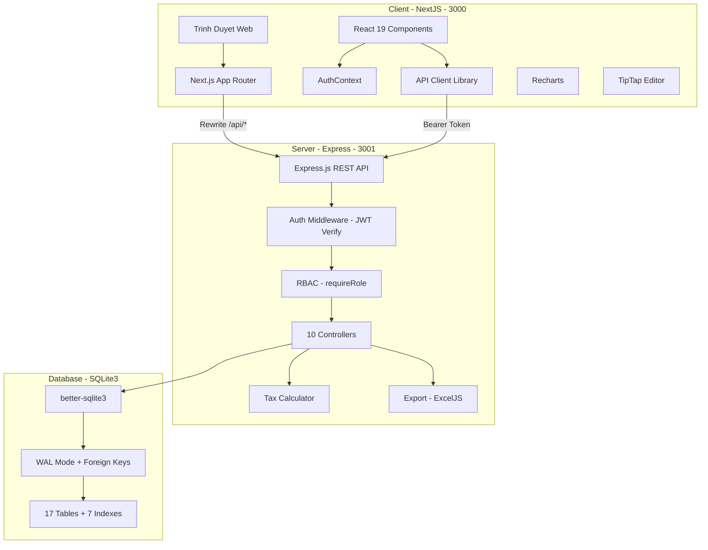
```mermaid
graph TB
    subgraph Client["Client - NextJS - 3000"]
        direction LR
        Browser["Trinh Duyet Web"]
        NextJS["Next.js App Router"]
        React["React 19 Components"]
        AuthCtx["AuthContext"]
        ApiLib["API Client Library"]
        Recharts["Recharts"]
        TipTap["TipTap Editor"]
    end

    subgraph Server["Server - Express - 3001"]
        direction LR
        Express["Express.js REST API"]
        AuthMW["Auth Middleware - JWT Verify"]
        RBAC["RBAC - requireRole"]
        Controllers["10 Controllers"]
        TaxCalc["Tax Calculator"]
        ExportSvc["Export - ExcelJS"]
    end

    subgraph Database["Database - SQLite3"]
        direction LR
        SQLite["better-sqlite3"]
        WAL["WAL Mode + Foreign Keys"]
        Tables["17 Tables + 7 Indexes"]
    end

    Browser --> NextJS
    NextJS -->|"Rewrite /api/*"| Express
    React --> AuthCtx
    React --> ApiLib
    ApiLib -->|"Bearer Token"| Express
    Express --> AuthMW
    AuthMW --> RBAC
    RBAC --> Controllers
    Controllers --> SQLite
    Controllers --> TaxCalc
    Controllers --> ExportSvc
    SQLite --> WAL
    WAL --> Tables
```

---

# 5. Mô Hình Kiến Trúc 3 Tầng (Three-Layer Architecture Model)

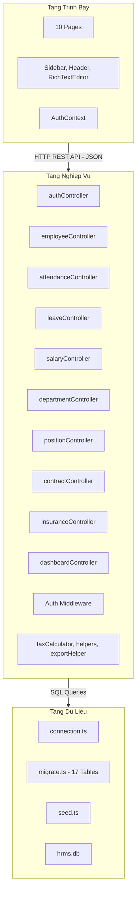
```mermaid
graph TB
    subgraph PresentationLayer["Tang Trinh Bay"]
        direction LR
        Pages["10 Pages"]
        Components["Sidebar, Header, RichTextEditor"]
        Contexts["AuthContext"]
    end

    subgraph BusinessLayer["Tang Nghiep Vu"]
        direction LR
        Auth["authController"]
        EmpCtrl["employeeController"]
        AttCtrl["attendanceController"]
        LeaveCtrl["leaveController"]
        SalaryCtrl["salaryController"]
        DeptCtrl["departmentController"]
        PosCtrl["positionController"]
        ContractCtrl["contractController"]
        InsCtrl["insuranceController"]
        DashCtrl["dashboardController"]
        Middleware["Auth Middleware"]
        Utils["taxCalculator, helpers, exportHelper"]
    end

    subgraph DataLayer["Tang Du Lieu"]
        direction LR
        Connection["connection.ts"]
        Migration["migrate.ts - 17 Tables"]
        Seed["seed.ts"]
        DB["hrms.db"]
    end

    PresentationLayer -->|"HTTP REST API - JSON"| BusinessLayer
    BusinessLayer -->|"SQL Queries"| DataLayer
```

| Tầng | Công nghệ | Vai trò |
|---|---|---|
| **Presentation** | Next.js 16, React 19, Tailwind CSS 4, Recharts, TipTap, Lucide Icons | Hiển thị giao diện, tương tác người dùng |
| **Business Logic** | Express 5, TypeScript, JWT, bcryptjs | Xử lý nghiệp vụ, xác thực, phân quyền, tính toán lương/thuế |
| **Data Access** | better-sqlite3, SQLite3 | Lưu trữ và truy xuất dữ liệu |

---

# 6. Biểu Đồ Use Case Tổng Quát

```mermaid
graph LR
    HRMO["HRMO - Admin"]:::actor
    Manager["Truong Phong"]:::actor
    Employee["Nhan Vien"]:::actor

    subgraph UC_Auth["Xac Thuc"]
        UC1(["Dang Nhap"])
        UC2(["Dang Xuat"])
        UC3(["Xem Ho So Ca Nhan"])
    end

    subgraph UC_Employee["Quan Ly Nhan Vien"]
        UC4(["Them Nhan Vien"])
        UC5(["Sua Nhan Vien"])
        UC6(["Xoa Nhan Vien"])
        UC7(["Xem Danh Sach Nhan Vien"])
        UC8(["Xem So Do To Chuc"])
        UC9(["Xuat Excel Nhan Vien"])
    end

    subgraph UC_Attendance["Cham Cong"]
        UC10(["Check-in"])
        UC11(["Check-out"])
        UC12(["Xem Lich Su Cham Cong"])
        UC13(["Duyet Cham Cong"])
        UC14(["Xuat Excel Cham Cong"])
    end

    subgraph UC_Leave["Nghi Phep"]
        UC15(["Tao Don Xin Nghi"])
        UC16(["Duyet Don Nghi"])
        UC17(["Huy Don Nghi"])
        UC18(["Xem So Ngay Phep Con"])
    end

    subgraph UC_Contract["Hop Dong"]
        UC19(["Tao Hop Dong"])
        UC20(["Sua Hop Dong"])
        UC21(["Xem Hop Dong"])
    end

    subgraph UC_Salary["Luong"]
        UC22(["Tinh Luong Thang"])
        UC23(["Duyet Bang Luong"])
        UC24(["Xac Nhan Thanh Toan"])
        UC25(["Xuat Excel Luong"])
    end

    subgraph UC_Other["Khac"]
        UC26(["Quan Ly Phong Ban"])
        UC27(["Quan Ly Vi Tri"])
        UC28(["Quan Ly Bao Hiem"])
        UC29(["Xem Dashboard Thong Ke"])
    end

    HRMO --> UC1 & UC2 & UC3
    HRMO --> UC4 & UC5 & UC6 & UC7 & UC8 & UC9
    HRMO --> UC10 & UC11 & UC12 & UC13 & UC14
    HRMO --> UC15 & UC16 & UC17 & UC18
    HRMO --> UC19 & UC20 & UC21
    HRMO --> UC22 & UC23 & UC24 & UC25
    HRMO --> UC26 & UC27 & UC28 & UC29

    Manager --> UC1 & UC2 & UC3
    Manager --> UC8
    Manager --> UC10 & UC11 & UC12 & UC13
    Manager --> UC15 & UC16 & UC17 & UC18
    Manager --> UC21
    Manager --> UC29

    Employee --> UC1 & UC2 & UC3
    Employee --> UC8
    Employee --> UC10 & UC11 & UC12
    Employee --> UC15 & UC17 & UC18
    Employee --> UC21
    Employee --> UC29

    classDef actor fill:#E8EAF6,stroke:#3F51B5,stroke-width:2px,color:#1A237E,font-weight:bold
```

---

# 7. Đặc Tả Use Case Chi Tiết (Detailed UseCase)

## 7.1. UC-01: Đăng Nhập Hệ Thống

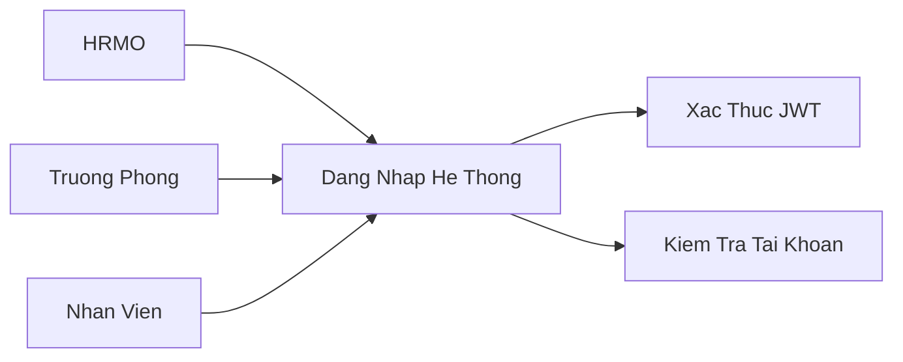
```mermaid
graph LR
    Actor1["HRMO"] --> UC1["Dang Nhap He Thong"]
    Actor2["Truong Phong"] --> UC1
    Actor3["Nhan Vien"] --> UC1
    UC1 --> S1["Xac Thuc JWT"]
    UC1 --> S2["Kiem Tra Tai Khoan"]
```

| Mục | Mô tả |
|---|---|
| **Tên Use Case** | UC-01: Đăng Nhập Hệ Thống |
| **Tác nhân** | HRMO, Trưởng Phòng, Nhân Viên |
| **Mô tả** | Người dùng đăng nhập vào hệ thống bằng email và mật khẩu |
| **Tiền điều kiện** | Tài khoản đã được tạo bởi HRMO và đang ở trạng thái active |
| **Hậu điều kiện** | Người dùng được xác thực, JWT token được lưu vào localStorage, chuyển hướng đến trang tương ứng |

**Luồng chính:**
1. Người dùng truy cập trang `/login`.
2. Hệ thống hiển thị form đăng nhập (email, mật khẩu).
3. Người dùng nhập email và mật khẩu, nhấn "Đăng Nhập".
4. Hệ thống gửi `POST /api/auth/login` đến server.
5. Server kiểm tra email tồn tại trong bảng `users` với `isActive = 1`.
6. Server so sánh mật khẩu với hash bằng `bcrypt.compare()`.
7. Server tạo JWT token (payload: id, email, role, employeeId; thời hạn 24h).
8. Client lưu token vào `localStorage`, cập nhật `AuthContext`.
9. Chuyển hướng đến trang Dashboard (HRMO) hoặc trang Chấm Công (Manager/Employee).

**Luồng thay thế:**
- **5a.** Email không tồn tại → Trả về lỗi "Email Hoặc Mật Khẩu Không Đúng".
- **6a.** Mật khẩu sai → Trả về lỗi "Email Hoặc Mật Khẩu Không Đúng".

---

## 7.2. UC-02: Quản Lý Nhân Viên (CRUD)

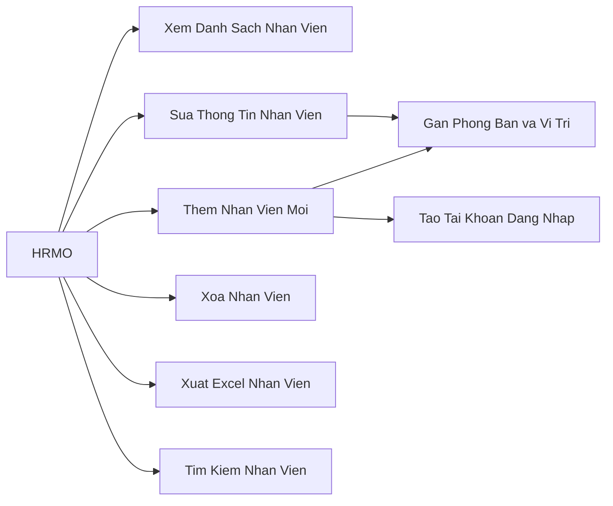
```mermaid
graph LR
    HRMO["HRMO"] --> UC1["Xem Danh Sach Nhan Vien"]
    HRMO --> UC2["Them Nhan Vien Moi"]
    HRMO --> UC3["Sua Thong Tin Nhan Vien"]
    HRMO --> UC4["Xoa Nhan Vien"]
    HRMO --> UC5["Xuat Excel Nhan Vien"]
    HRMO --> UC6["Tim Kiem Nhan Vien"]
    UC2 --> S1["Gan Phong Ban va Vi Tri"]
    UC2 --> S2["Tao Tai Khoan Dang Nhap"]
    UC3 --> S1
```

| Mục | Mô tả |
|---|---|
| **Tên Use Case** | UC-02: Quản Lý Nhân Viên |
| **Tác nhân** | HRMO |
| **Mô tả** | HRMO thực hiện thêm, sửa, xóa, xem danh sách và xuất Excel nhân viên |
| **Tiền điều kiện** | Đã đăng nhập với quyền HRMO |
| **Hậu điều kiện** | Dữ liệu nhân viên được cập nhật trong bảng `employees` |

**Luồng chính (Thêm nhân viên):**
1. HRMO truy cập trang "Nhân Viên", nhấn "Thêm Nhân Viên".
2. Hệ thống hiển thị form gồm 29 trường (thông tin cá nhân, CCCD, ngân hàng, thuế, phòng ban, vị trí).
3. HRMO điền thông tin, chọn phòng ban và vị trí từ danh sách.
4. HRMO chọn `managerId` (bắt buộc cho nhân viên, null cho manager).
5. Server gửi `POST /api/employees`, validate dữ liệu.
6. Server tạo UUID, lưu bản ghi vào bảng `employees`.
7. Server tự động tạo tài khoản đăng nhập trong bảng `users`.
8. Trả về kết quả thành công, cập nhật danh sách.

**Luồng chính (Sửa nhân viên):**
1. HRMO nhấn nút "Sửa" trên một nhân viên.
2. Hệ thống hiện form với dữ liệu hiện tại.
3. HRMO chỉnh sửa thông tin, nhấn "Lưu".
4. Server gửi `PUT /api/employees/:id`, cập nhật bản ghi.

**Luồng chính (Xóa nhân viên):**
1. HRMO nhấn nút "Xóa", hệ thống hiện xác nhận.
2. Server gửi `DELETE /api/employees/:id`.
3. Server kiểm tra nhân viên không có dữ liệu liên quan (chấm công, hợp đồng...).
4. Xóa bản ghi nhân viên và tài khoản liên quan.

**Luồng chính (Xuất Excel):**
1. HRMO nhấn "Xuất Excel".
2. Server gửi `GET /api/employees/export`.
3. Server tạo file .xlsx bằng ExcelJS với header màu xanh (#166534).
4. Client tải file về máy.

**Luồng thay thế:**
- **3a.** Email hoặc CCCD đã tồn tại → Trả về lỗi trùng lặp.
- **3b.** Thiếu trường bắt buộc → Trả về lỗi validation.

---

## 7.3. UC-03: Xem Sơ Đồ Tổ Chức

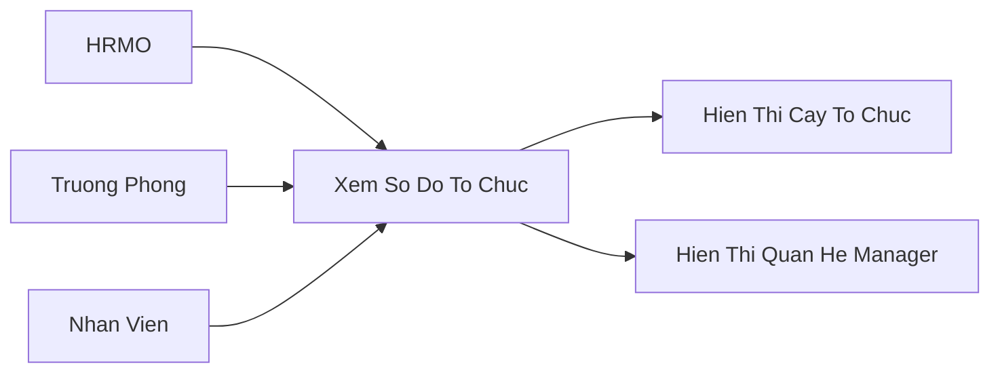
```mermaid
graph LR
    HRMO["HRMO"] --> UC1["Xem So Do To Chuc"]
    Manager["Truong Phong"] --> UC1
    Employee["Nhan Vien"] --> UC1
    UC1 --> S1["Hien Thi Cay To Chuc"]
    UC1 --> S2["Hien Thi Quan He Manager"]
```

| Mục | Mô tả |
|---|---|
| **Tên Use Case** | UC-03: Xem Sơ Đồ Tổ Chức |
| **Tác nhân** | HRMO, Trưởng Phòng, Nhân Viên |
| **Mô tả** | Hiển thị cây tổ chức phòng ban - nhân viên dựa trên quan hệ managerId |
| **Tiền điều kiện** | Đã đăng nhập |
| **Hậu điều kiện** | Sơ đồ tổ chức được hiển thị dạng cây |

**Luồng chính:**
1. Người dùng truy cập trang "Sơ Đồ Tổ Chức".
2. Client gửi `GET /api/employees/orgchart`.
3. Server truy vấn tất cả nhân viên với quan hệ `managerId`.
4. Server trả về danh sách nhân viên kèm thông tin phòng ban, vị trí.
5. Client render sơ đồ dạng cây tổ chức.

---

## 7.4. UC-04: Chấm Công (Check-in / Check-out)

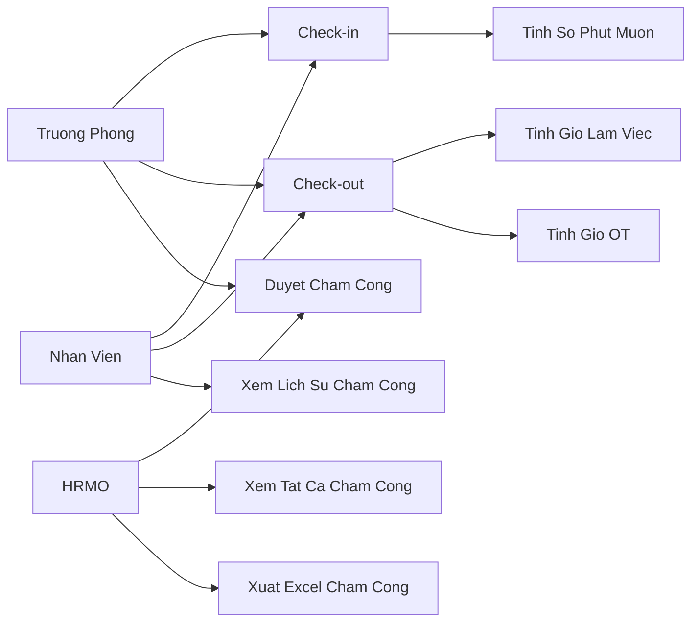
```mermaid
graph LR
    Employee["Nhan Vien"] --> UC1["Check-in"]
    Employee --> UC2["Check-out"]
    Manager["Truong Phong"] --> UC1
    Manager --> UC2
    Manager --> UC3["Duyet Cham Cong"]
    HRMO["HRMO"] --> UC3
    HRMO --> UC4["Xem Tat Ca Cham Cong"]
    HRMO --> UC5["Xuat Excel Cham Cong"]
    Employee --> UC6["Xem Lich Su Cham Cong"]
    UC1 --> S1["Tinh So Phut Muon"]
    UC2 --> S2["Tinh Gio Lam Viec"]
    UC2 --> S3["Tinh Gio OT"]
```

| Mục | Mô tả |
|---|---|
| **Tên Use Case** | UC-04: Chấm Công |
| **Tác nhân** | Nhân Viên, Trưởng Phòng, HRMO |
| **Mô tả** | Nhân viên ghi nhận giờ vào/ra, hệ thống tính đi muộn/về sớm, Trưởng Phòng duyệt |
| **Tiền điều kiện** | Đã đăng nhập |
| **Hậu điều kiện** | Bản ghi attendance được tạo/cập nhật, approvalStatus = pending |

**Luồng chính (Check-in):**
1. Nhân viên nhấn nút "Check-in" tại trang Chấm Công.
2. Hệ thống gửi `POST /api/attendance/checkIn`.
3. Server kiểm tra chưa có bản ghi attendance cho ngày hôm nay.
4. Server ghi nhận giờ check-in hiện tại (HH:MM:SS).
5. Server so sánh với giờ quy định `08:30:00` — nếu trễ, tính `checkInLate` (phút).
6. Tạo bản ghi attendance với `status = 'present'`, `approvalStatus = 'pending'`.
7. Trả về kết quả thành công.

**Luồng chính (Check-out):**
1. Nhân viên nhấn nút "Check-out".
2. Hệ thống gửi `POST /api/attendance/checkOut`.
3. Server tìm bản ghi attendance hôm nay (đã check-in, chưa check-out).
4. Server ghi nhận giờ check-out.
5. So sánh với giờ kết thúc `17:30:00` — nếu sớm, tính `checkOutEarly` (phút).
6. Tính `workingHours` = (checkOut - checkIn - 60 phút nghỉ trưa) / 60.
7. Nếu checkOut > 17:30, tính `overtimeHours` = (checkOut - 17:30) / 60.
8. Cập nhật bản ghi attendance.

**Luồng chính (Duyệt chấm công):**
1. Trưởng Phòng/HRMO truy cập danh sách chấm công chờ duyệt.
2. Nhấn "Duyệt" hoặc "Từ chối" cho từng bản ghi.
3. Server gửi `PUT /api/attendance/:id/approve`.
4. Server kiểm tra quyền duyệt bằng `canApprove()` (HRMO duyệt tất cả, Manager chỉ duyệt team).
5. Cập nhật `approvalStatus` = 'approved' hoặc 'rejected'.

**Luồng thay thế:**
- **3a.** Đã check-in hôm nay → Trả về lỗi "Bạn Đã Chấm Công Vào Hôm Nay".
- **3b (Check-out).** Chưa check-in → Trả về lỗi "Bạn Chưa Chấm Công Vào Hôm Nay".
- **3c (Check-out).** Đã check-out rồi → Trả về lỗi "Bạn Đã Chấm Công Ra Hôm Nay".

---

## 7.5. UC-05: Quản Lý Đơn Xin Nghỉ Phép

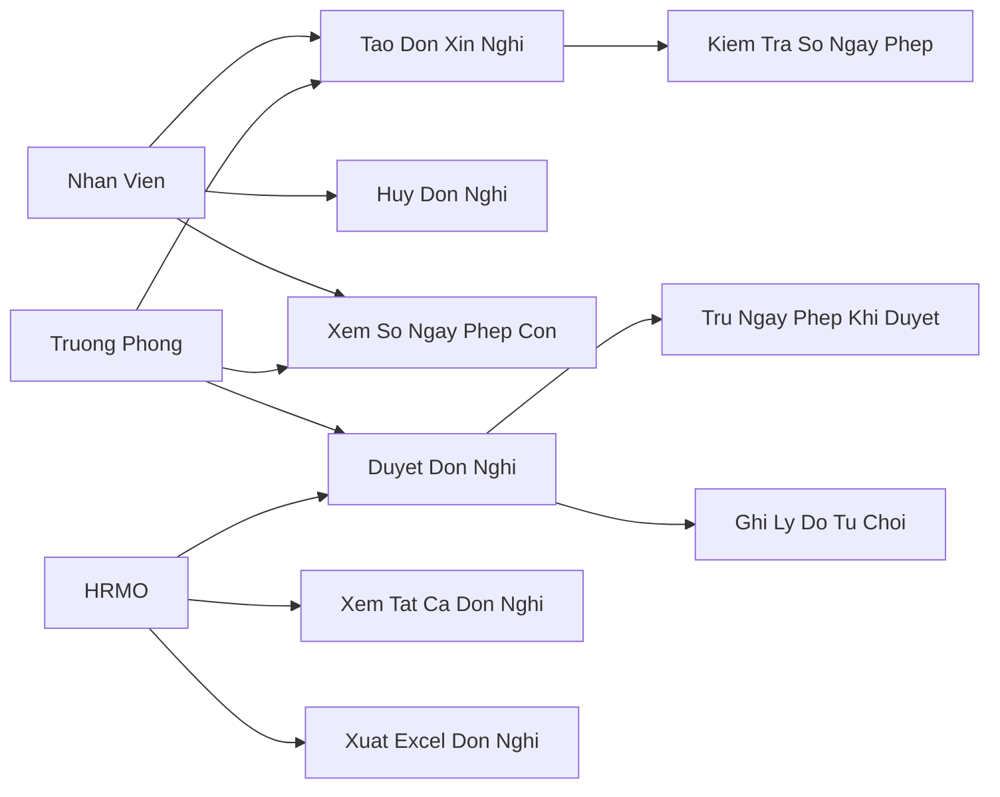
```mermaid
graph LR
    Employee["Nhan Vien"] --> UC1["Tao Don Xin Nghi"]
    Employee --> UC2["Huy Don Nghi"]
    Employee --> UC3["Xem So Ngay Phep Con"]
    Manager["Truong Phong"] --> UC1
    Manager --> UC4["Duyet Don Nghi"]
    Manager --> UC3
    HRMO["HRMO"] --> UC4
    HRMO --> UC5["Xem Tat Ca Don Nghi"]
    HRMO --> UC6["Xuat Excel Don Nghi"]
    UC1 --> S1["Kiem Tra So Ngay Phep"]
    UC4 --> S2["Tru Ngay Phep Khi Duyet"]
    UC4 --> S3["Ghi Ly Do Tu Choi"]
```

| Mục | Mô tả |
|---|---|
| **Tên Use Case** | UC-05: Quản Lý Đơn Xin Nghỉ Phép |
| **Tác nhân** | Nhân Viên, Trưởng Phòng, HRMO |
| **Mô tả** | Nhân viên tạo đơn xin nghỉ, Trưởng Phòng/HRMO duyệt hoặc từ chối |
| **Tiền điều kiện** | Đã đăng nhập, có dữ liệu leaveBalances cho năm hiện tại |
| **Hậu điều kiện** | Đơn nghỉ phép được tạo (pending) hoặc cập nhật (approved/rejected/cancelled) |

**Luồng chính (Tạo đơn):**
1. Nhân viên truy cập trang "Đơn Xin Nghỉ", nhấn "Tạo Đơn Mới".
2. Hệ thống hiển thị form: loại nghỉ (từ bảng `leaveTypes`), ngày bắt đầu, ngày kết thúc, lý do.
3. Nhân viên điền thông tin và gửi.
4. Server tính tổng ngày nghỉ (`totalDays`).
5. Server kiểm tra số ngày phép còn lại trong bảng `leaveBalances`.
6. Tạo bản ghi `leaveRequests` với `status = 'pending'`.
7. Trả về kết quả thành công.

**Luồng chính (Duyệt đơn):**
1. Trưởng Phòng/HRMO xem danh sách đơn nghỉ chờ duyệt.
2. Nhấn "Đồng ý" hoặc "Từ chối" (nhập lý do nếu từ chối).
3. Server gửi `PUT /api/leaveRequests/:id/approve`.
4. Nếu đồng ý: cập nhật `status = 'approved'`, trừ `usedDays` trong `leaveBalances`.
5. Nếu từ chối: cập nhật `status = 'rejected'`, ghi `rejectionReason`.

**Luồng chính (Hủy đơn):**
1. Nhân viên chọn đơn nghỉ đang pending, nhấn "Hủy".
2. Server gửi `PUT /api/leaveRequests/:id/cancel`.
3. Cập nhật `status = 'cancelled'`.

**Luồng thay thế:**
- **5a.** Không đủ ngày phép → Trả về lỗi "Không Đủ Ngày Phép".
- **2a (Duyệt).** Không có quyền duyệt → Trả về lỗi "Không Có Quyền".

---

## 7.6. UC-06: Quản Lý Hợp Đồng Lao Động

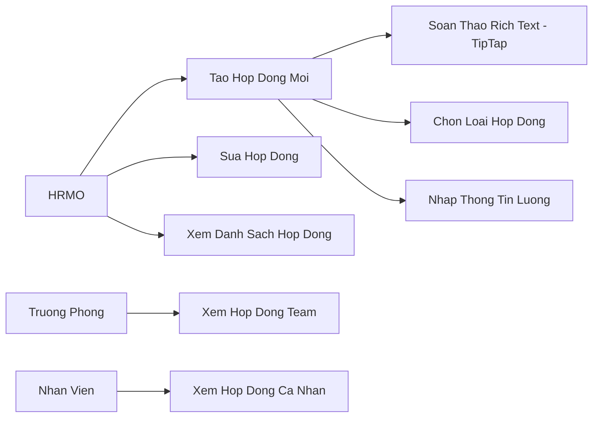
```mermaid
graph LR
    HRMO["HRMO"] --> UC1["Tao Hop Dong Moi"]
    HRMO --> UC2["Sua Hop Dong"]
    HRMO --> UC3["Xem Danh Sach Hop Dong"]
    Manager["Truong Phong"] --> UC4["Xem Hop Dong Team"]
    Employee["Nhan Vien"] --> UC5["Xem Hop Dong Ca Nhan"]
    UC1 --> S1["Soan Thao Rich Text - TipTap"]
    UC1 --> S2["Chon Loai Hop Dong"]
    UC1 --> S3["Nhap Thong Tin Luong"]
```

| Mục | Mô tả |
|---|---|
| **Tên Use Case** | UC-06: Quản Lý Hợp Đồng Lao Động |
| **Tác nhân** | HRMO (CRUD), Trưởng Phòng (xem team), Nhân Viên (xem cá nhân) |
| **Mô tả** | HRMO tạo, sửa và quản lý hợp đồng lao động với rich text editor |
| **Tiền điều kiện** | Đã đăng nhập, nhân viên đã tồn tại trong hệ thống |
| **Hậu điều kiện** | Hợp đồng được lưu trong bảng `contracts` |

**Luồng chính (Tạo hợp đồng):**
1. HRMO truy cập trang "Hợp Đồng", nhấn "Tạo Hợp Đồng".
2. Chọn nhân viên, loại hợp đồng (probation/definite/indefinite).
3. Nhập thông tin: ngày bắt đầu/kết thúc, lương gross, loại lương, giờ làm/ngày, ngày làm/tuần.
4. Soạn nội dung hợp đồng bằng rich text editor TipTap.
5. Lưu với `status = 'draft'`.
6. Khi ký, cập nhật `status = 'active'`, ghi `signedDate`.

**Luồng thay thế:**
- **2a.** Mã hợp đồng đã tồn tại → Trả về lỗi trùng lặp.

---

## 7.7. UC-07: Tính Lương Hàng Tháng

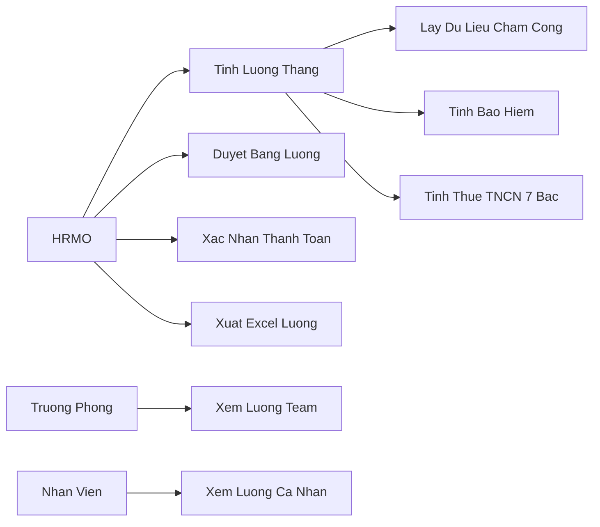
```mermaid
graph LR
    HRMO["HRMO"] --> UC1["Tinh Luong Thang"]
    HRMO --> UC2["Duyet Bang Luong"]
    HRMO --> UC3["Xac Nhan Thanh Toan"]
    HRMO --> UC4["Xuat Excel Luong"]
    Manager["Truong Phong"] --> UC5["Xem Luong Team"]
    Employee["Nhan Vien"] --> UC6["Xem Luong Ca Nhan"]
    UC1 --> S1["Lay Du Lieu Cham Cong"]
    UC1 --> S2["Tinh Bao Hiem"]
    UC1 --> S3["Tinh Thue TNCN 7 Bac"]
```

| Mục | Mô tả |
|---|---|
| **Tên Use Case** | UC-07: Tính Lương Hàng Tháng |
| **Tác nhân** | HRMO (tính/duyệt/thanh toán), Trưởng Phòng (xem team), Nhân Viên (xem cá nhân) |
| **Mô tả** | HRMO tính lương cho nhân viên theo tháng, áp dụng biểu thuế TNCN lũy tiến 7 bậc |
| **Tiền điều kiện** | Dữ liệu chấm công tháng đó đã có, nhân viên có hợp đồng active |
| **Hậu điều kiện** | Bảng lương tháng được tạo/cập nhật trong bảng `salaries` |

**Luồng chính (Tính lương):**
1. HRMO chọn tháng, năm và nhấn "Tính Lương".
2. Server lấy tất cả nhân viên có `employmentStatus = 'active'` kèm hợp đồng `status = 'active'`.
3. Với mỗi nhân viên, tính ngày công chuẩn = số ngày trong tháng - ngày cuối tuần - ngày lễ (từ bảng `holidays`).
4. Lấy số ngày công thực tế từ bảng `attendance` (chỉ các bản ghi `approvalStatus = 'approved'`).
5. Tính lương cơ bản: `basicSalary = grossSalary * (workingDays / standardWorkingDays)`.
6. Tính tiền làm thêm giờ: `OT = (grossSalary / standardWorkingDays / 8) * 1.5 * overtimeHours`.
7. Cộng phụ cấp (từ `employeeAllowances` còn hiệu lực).
8. Tính tổng Gross = basicSalary + allowances + overtime (bonus mặc định = 0).
9. Trừ BHXH (8%), BHYT (1.5%), BHTN (1%) — mức trần 36.000.000 VND.
10. Tính thu nhập chịu thuế = Gross - Bảo hiểm - Giảm trừ gia cảnh (11.000.000 VND) - Giảm trừ người phụ thuộc (4.400.000 VND/người, mặc định = 0).
11. Áp dụng biểu thuế TNCN lũy tiến 7 bậc (5%, 10%, 15%, 20%, 25%, 30%, 35%).
12. Net = Gross - Tổng bảo hiểm - Thuế TNCN.
13. Lưu vào bảng `salaries` với `status = 'draft'`. Nếu đã tồn tại bảng lương tháng đó thì cập nhật (upsert).

**Luồng chính (Duyệt):**
1. HRMO xem bảng lương draft, nhấn "Duyệt".
2. Server gửi `PUT /api/salaries/:id/approve`.
3. Cập nhật `status = 'approved'`.

**Luồng chính (Thanh toán):**
1. HRMO chọn bảng lương approved, nhấn "Thanh Toán".
2. Server gửi `PUT /api/salaries/:id/pay`.
3. Kiểm tra `status === 'approved'` — nếu chưa duyệt, trả về lỗi "Bảng Lương Chưa Được Duyệt".
4. Cập nhật `status = 'paid'`, ghi `paidDate`.

**Luồng thay thế:**
- **2a.** Nhân viên chưa có hợp đồng active → `contractSalary = 0`, lương = 0.

---

## 7.8. UC-08: Quản Lý Phòng Ban và Vị Trí

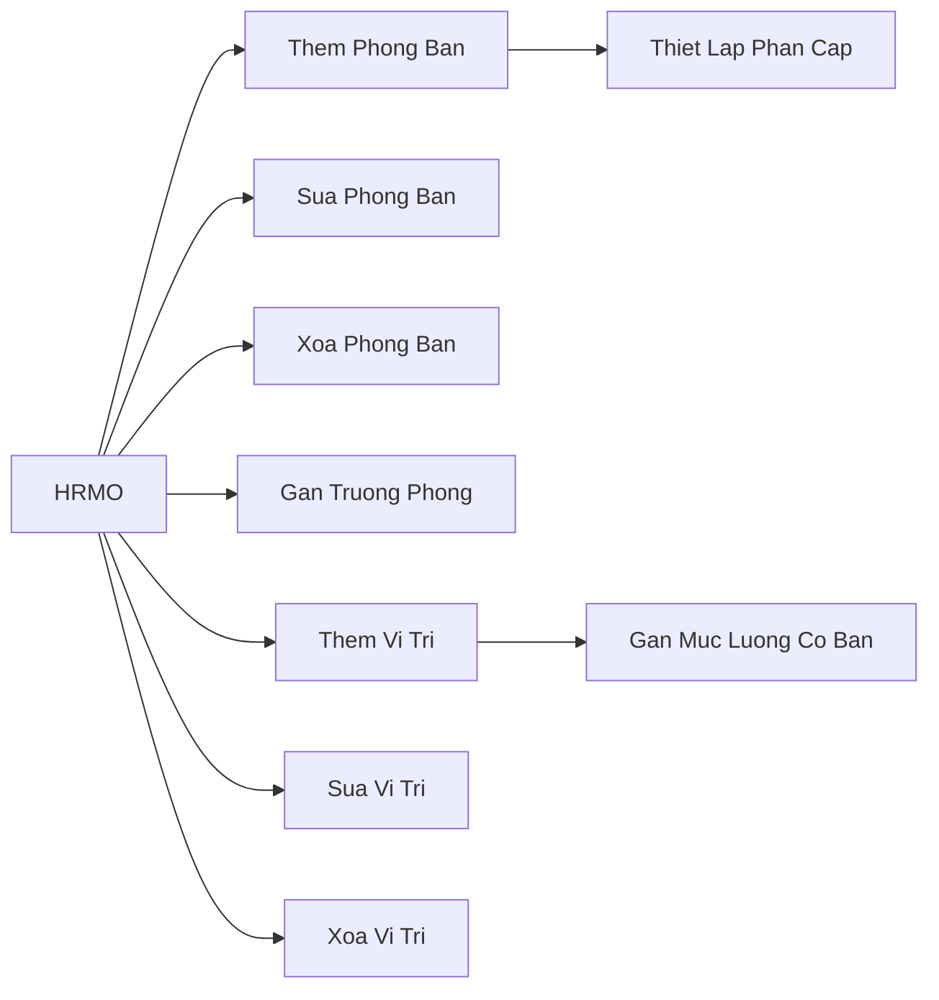
```mermaid
graph LR
    HRMO["HRMO"] --> UC1["Them Phong Ban"]
    HRMO --> UC2["Sua Phong Ban"]
    HRMO --> UC3["Xoa Phong Ban"]
    HRMO --> UC4["Gan Truong Phong"]
    HRMO --> UC5["Them Vi Tri"]
    HRMO --> UC6["Sua Vi Tri"]
    HRMO --> UC7["Xoa Vi Tri"]
    UC1 --> S1["Thiet Lap Phan Cap"]
    UC5 --> S2["Gan Muc Luong Co Ban"]
```

| Mục | Mô tả |
|---|---|
| **Tên Use Case** | UC-08: Quản Lý Phòng Ban và Vị Trí |
| **Tác nhân** | HRMO |
| **Mô tả** | HRMO quản lý cấu trúc phòng ban phân cấp và danh mục chức danh |
| **Tiền điều kiện** | Đã đăng nhập với quyền HRMO |
| **Hậu điều kiện** | Dữ liệu phòng ban/vị trí được cập nhật |

**Luồng chính (Phòng ban):**
1. HRMO truy cập trang "Phòng Ban", hiển thị danh sách phòng ban với số nhân viên.
2. Nhấn "Thêm Phòng Ban": nhập tên, mã code, chọn phòng ban cha (nếu có), chọn trưởng phòng.
3. Server gửi `POST /api/departments`, tạo UUID, lưu bản ghi.
4. Sửa/Xóa: `PUT /api/departments/:id`, `DELETE /api/departments/:id`.

**Luồng chính (Vị trí):**
1. HRMO truy cập trang "Vị Trí", hiển thị danh sách vị trí với phòng ban và mức lương cơ bản.
2. Nhấn "Thêm Vị Trí": nhập tên, mã code, cấp bậc (level), chọn phòng ban, nhập mức lương cơ bản.
3. Server gửi `POST /api/positions`, tạo UUID, lưu bản ghi.

**Luồng thay thế:**
- **Xóa phòng ban.** Phòng ban còn nhân viên → Trả về lỗi "Không thể xóa".
- **Xóa vị trí.** Vị trí đang được gán cho nhân viên → Trả về lỗi.

---

## 7.9. UC-09: Quản Lý Bảo Hiểm

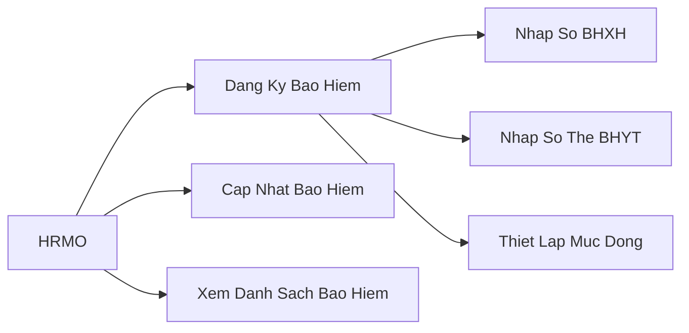
```mermaid
graph LR
    HRMO["HRMO"] --> UC1["Dang Ky Bao Hiem"]
    HRMO --> UC2["Cap Nhat Bao Hiem"]
    HRMO --> UC3["Xem Danh Sach Bao Hiem"]
    UC1 --> S1["Nhap So BHXH"]
    UC1 --> S2["Nhap So The BHYT"]
    UC1 --> S3["Thiet Lap Muc Dong"]
```

| Mục | Mô tả |
|---|---|
| **Tên Use Case** | UC-09: Quản Lý Bảo Hiểm |
| **Tác nhân** | HRMO |
| **Mô tả** | HRMO quản lý thông tin BHXH, BHYT, BHTN cho nhân viên |
| **Tiền điều kiện** | Nhân viên đã tồn tại trong hệ thống |
| **Hậu điều kiện** | Bản ghi bảo hiểm được lưu trong bảng `insurance` (UNIQUE trên employeeId) |

**Luồng chính:**
1. HRMO truy cập trang "Bảo Hiểm", hiển thị danh sách nhân viên và trạng thái bảo hiểm.
2. Nhấn "Đăng Ký" cho nhân viên mới.
3. Nhập: số sổ BHXH, số thẻ BHYT, nơi KCB, ngày đăng ký.
4. Thiết lập mức đóng: BHXH (mặc định 8%), BHYT (1.5%), BHTN (1%).
5. Nhập mức lương cơ sở tính bảo hiểm (trần 36.000.000 VND).
6. Server gửi `POST /api/insurance`, lưu với `status = 'active'`.

**Luồng thay thế:**
- **2a.** Nhân viên đã có bản ghi bảo hiểm → Chuyển sang chế độ cập nhật.

---

## 7.10. UC-10: Xem Dashboard Thống Kê

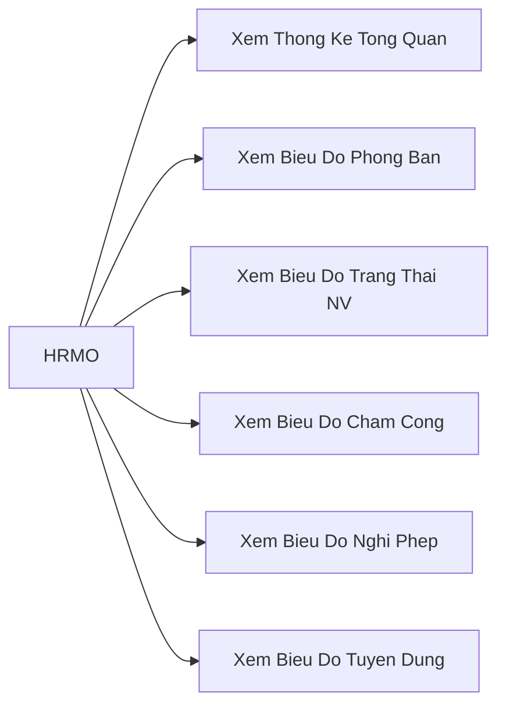
```mermaid
graph LR
    HRMO["HRMO"] --> UC1["Xem Thong Ke Tong Quan"]
    HRMO --> UC2["Xem Bieu Do Phong Ban"]
    HRMO --> UC3["Xem Bieu Do Trang Thai NV"]
    HRMO --> UC4["Xem Bieu Do Cham Cong"]
    HRMO --> UC5["Xem Bieu Do Nghi Phep"]
    HRMO --> UC6["Xem Bieu Do Tuyen Dung"]
```

| Mục | Mô tả |
|---|---|
| **Tên Use Case** | UC-10: Xem Dashboard Thống Kê |
| **Tác nhân** | HRMO |
| **Mô tả** | HRMO xem tổng quan hệ thống với 7 chỉ số KPI và 5 biểu đồ |
| **Tiền điều kiện** | Đã đăng nhập với quyền HRMO |
| **Hậu điều kiện** | Dashboard được hiển thị với dữ liệu real-time |

**Luồng chính:**
1. HRMO truy cập trang "Bảng Điều Khiển".
2. Client gửi song song 6 API calls:
   - `GET /api/dashboard/stats` → 7 KPI (tổng NV, NV active, NV thử việc, tổng phòng ban, chấm công hôm nay, đơn nghỉ chờ duyệt, chấm công chờ duyệt).
   - `GET /api/dashboard/employeesByDepartment` → Bar chart phân bố NV theo phòng ban.
   - `GET /api/dashboard/employeeStatus` → Pie chart trạng thái NV.
   - `GET /api/dashboard/monthlyAttendance` → Line chart chấm công 12 tháng.
   - `GET /api/dashboard/leaveStatistics` → Bar chart thống kê nghỉ phép theo loại.
   - `GET /api/dashboard/hiringTrends` → Line chart xu hướng tuyển dụng 12 tháng.
3. Client render 5 biểu đồ Recharts (BarChart, PieChart, LineChart).

**Luồng thay thế:**
- Không có dữ liệu → Hiển thị biểu đồ trống với giá trị 0.

---

# 8. Biểu Đồ Lớp (Class Diagram)

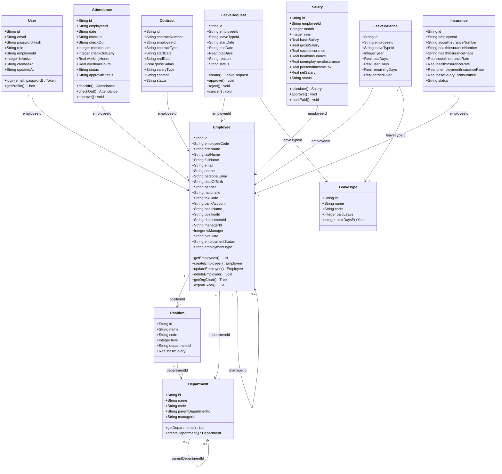
```mermaid
classDiagram
    class User {
        +String id
        +String email
        +String passwordHash
        +String role
        +String employeeId
        +Integer isActive
        +String createdAt
        +String updatedAt
        +login(email, password) Token
        +getProfile() User
    }

    class Employee {
        +String id
        +String employeeCode
        +String firstName
        +String lastName
        +String fullName
        +String email
        +String phone
        +String personalEmail
        +String dateOfBirth
        +String gender
        +String nationalId
        +String taxCode
        +String bankAccount
        +String bankName
        +String positionId
        +String departmentId
        +String managerId
        +Integer isManager
        +String hireDate
        +String employmentStatus
        +String employmentType
        +getEmployees() List
        +createEmployee() Employee
        +updateEmployee() Employee
        +deleteEmployee() void
        +getOrgChart() Tree
        +exportExcel() File
    }

    class Department {
        +String id
        +String name
        +String code
        +String parentDepartmentId
        +String managerId
        +getDepartments() List
        +createDepartment() Department
    }

    class Position {
        +String id
        +String name
        +String code
        +Integer level
        +String departmentId
        +Real baseSalary
    }

    class Attendance {
        +String id
        +String employeeId
        +String date
        +String checkIn
        +String checkOut
        +Integer checkInLate
        +Integer checkOutEarly
        +Real workingHours
        +Real overtimeHours
        +String status
        +String approvalStatus
        +checkIn() Attendance
        +checkOut() Attendance
        +approve() void
    }

    class LeaveRequest {
        +String id
        +String employeeId
        +String leaveTypeId
        +String startDate
        +String endDate
        +Real totalDays
        +String reason
        +String status
        +create() LeaveRequest
        +approve() void
        +reject() void
        +cancel() void
    }

    class LeaveType {
        +String id
        +String name
        +String code
        +Integer paidLeave
        +Integer maxDaysPerYear
    }

    class LeaveBalance {
        +String id
        +String employeeId
        +String leaveTypeId
        +Integer year
        +Real totalDays
        +Real usedDays
        +Real remainingDays
        +Real carriedOver
    }

    class Contract {
        +String id
        +String contractNumber
        +String employeeId
        +String contractType
        +String startDate
        +String endDate
        +Real grossSalary
        +String salaryType
        +String content
        +String status
    }

    class Salary {
        +String id
        +String employeeId
        +Integer month
        +Integer year
        +Real basicSalary
        +Real grossSalary
        +Real socialInsurance
        +Real healthInsurance
        +Real unemploymentInsurance
        +Real personalIncomeTax
        +Real netSalary
        +String status
        +calculate() Salary
        +approve() void
        +markPaid() void
    }

    class Insurance {
        +String id
        +String employeeId
        +String socialInsuranceNumber
        +String healthInsuranceNumber
        +String healthInsurancePlace
        +Real socialInsuranceRate
        +Real healthInsuranceRate
        +Real unemploymentInsuranceRate
        +Real baseSalaryForInsurance
        +String status
    }

    User "1" --> "1" Employee : employeeId
    Employee "1" --> "1" Position : positionId
    Employee "1" --> "1" Department : departmentId
    Employee "0..1" --> "0..1" Employee : managerId
    Position "1" --> "1" Department : departmentId
    Department "0..1" --> "0..1" Department : parentDepartmentId
    Attendance "*" --> "1" Employee : employeeId
    LeaveRequest "*" --> "1" Employee : employeeId
    LeaveRequest "*" --> "1" LeaveType : leaveTypeId
    LeaveBalance "*" --> "1" Employee : employeeId
    LeaveBalance "*" --> "1" LeaveType : leaveTypeId
    Contract "*" --> "1" Employee : employeeId
    Salary "*" --> "1" Employee : employeeId
    Insurance "0..1" --> "1" Employee : employeeId
```

---

# 9. Biểu Đồ Quan Hệ (Relationship Diagram)

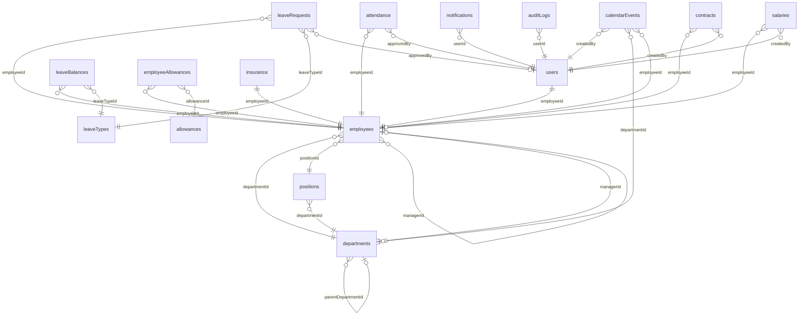
```mermaid
erDiagram
    users ||--|| employees : "employeeId"
    employees }o--|| departments : "departmentId"
    employees }o--|| positions : "positionId"
    employees }o--o| employees : "managerId"
    positions }o--|| departments : "departmentId"
    departments }o--o| departments : "parentDepartmentId"
    departments }o--o| employees : "managerId"
    attendance }o--|| employees : "employeeId"
    attendance }o--o| users : "approvedBy"
    leaveRequests }o--|| employees : "employeeId"
    leaveRequests }o--|| leaveTypes : "leaveTypeId"
    leaveRequests }o--o| users : "approvedBy"
    leaveBalances }o--|| employees : "employeeId"
    leaveBalances }o--|| leaveTypes : "leaveTypeId"
    contracts }o--|| employees : "employeeId"
    contracts }o--|| users : "createdBy"
    salaries }o--|| employees : "employeeId"
    salaries }o--|| users : "createdBy"
    employeeAllowances }o--|| employees : "employeeId"
    employeeAllowances }o--|| allowances : "allowanceId"
    insurance ||--|| employees : "employeeId"
    notifications }o--|| users : "userId"
    auditLogs }o--|| users : "userId"
    calendarEvents }o--|| users : "createdBy"
    calendarEvents }o--o| departments : "departmentId"
    calendarEvents }o--o| employees : "employeeId"
```

---

# 10. Biểu Đồ ERD (Entity-Relationship Diagram)

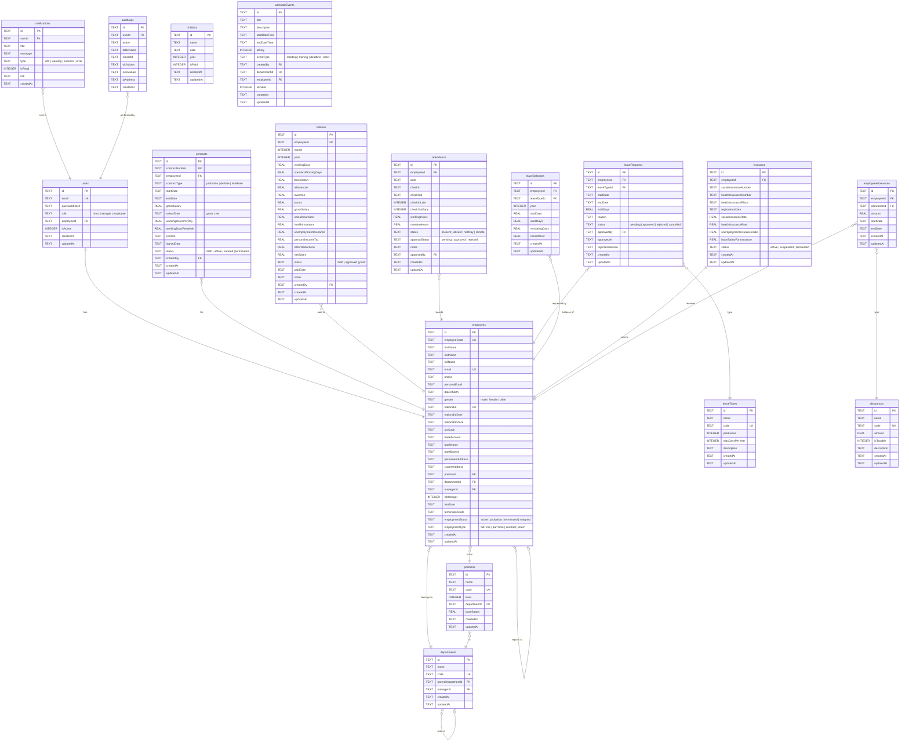
```mermaid
erDiagram
    users {
        TEXT id PK
        TEXT email UK
        TEXT passwordHash
        TEXT role "hrro | manager | employee"
        TEXT employeeId FK
        INTEGER isActive
        TEXT createdAt
        TEXT updatedAt
    }

    employees {
        TEXT id PK
        TEXT employeeCode UK
        TEXT firstName
        TEXT lastName
        TEXT fullName
        TEXT email UK
        TEXT phone
        TEXT personalEmail
        TEXT dateOfBirth
        TEXT gender "male | female | other"
        TEXT nationalId UK
        TEXT nationalIdDate
        TEXT nationalIdPlace
        TEXT taxCode
        TEXT bankAccount
        TEXT bankName
        TEXT bankBranch
        TEXT permanentAddress
        TEXT currentAddress
        TEXT positionId FK
        TEXT departmentId FK
        TEXT managerId FK
        INTEGER isManager
        TEXT hireDate
        TEXT terminationDate
        TEXT employmentStatus "active | probation | terminated | resigned"
        TEXT employmentType "fullTime | partTime | contract | intern"
        TEXT createdAt
        TEXT updatedAt
    }

    departments {
        TEXT id PK
        TEXT name
        TEXT code UK
        TEXT parentDepartmentId FK
        TEXT managerId FK
        TEXT createdAt
        TEXT updatedAt
    }

    positions {
        TEXT id PK
        TEXT name
        TEXT code UK
        INTEGER level
        TEXT departmentId FK
        REAL baseSalary
        TEXT createdAt
        TEXT updatedAt
    }

    contracts {
        TEXT id PK
        TEXT contractNumber UK
        TEXT employeeId FK
        TEXT contractType "probation | definite | indefinite"
        TEXT startDate
        TEXT endDate
        REAL grossSalary
        TEXT salaryType "gross | net"
        REAL workingHoursPerDay
        REAL workingDaysPerWeek
        TEXT content
        TEXT signedDate
        TEXT status "draft | active | expired | terminated"
        TEXT createdBy FK
        TEXT createdAt
        TEXT updatedAt
    }

    salaries {
        TEXT id PK
        TEXT employeeId FK
        INTEGER month
        INTEGER year
        REAL workingDays
        REAL standardWorkingDays
        REAL basicSalary
        REAL allowances
        REAL overtime
        REAL bonus
        REAL grossSalary
        REAL socialInsurance
        REAL healthInsurance
        REAL unemploymentInsurance
        REAL personalIncomeTax
        REAL otherDeductions
        REAL netSalary
        TEXT status "draft | approved | paid"
        TEXT paidDate
        TEXT notes
        TEXT createdBy FK
        TEXT createdAt
        TEXT updatedAt
    }

    attendance {
        TEXT id PK
        TEXT employeeId FK
        TEXT date
        TEXT checkIn
        TEXT checkOut
        INTEGER checkInLate
        INTEGER checkOutEarly
        REAL workingHours
        REAL overtimeHours
        TEXT status "present | absent | halfDay | remote"
        TEXT approvalStatus "pending | approved | rejected"
        TEXT notes
        TEXT approvedBy FK
        TEXT createdAt
        TEXT updatedAt
    }

    leaveTypes {
        TEXT id PK
        TEXT name
        TEXT code UK
        INTEGER paidLeave
        INTEGER maxDaysPerYear
        TEXT description
        TEXT createdAt
        TEXT updatedAt
    }

    leaveRequests {
        TEXT id PK
        TEXT employeeId FK
        TEXT leaveTypeId FK
        TEXT startDate
        TEXT endDate
        REAL totalDays
        TEXT reason
        TEXT status "pending | approved | rejected | cancelled"
        TEXT approvedBy FK
        TEXT approvedAt
        TEXT rejectionReason
        TEXT createdAt
        TEXT updatedAt
    }

    leaveBalances {
        TEXT id PK
        TEXT employeeId FK
        TEXT leaveTypeId FK
        INTEGER year
        REAL totalDays
        REAL usedDays
        REAL remainingDays
        REAL carriedOver
        TEXT createdAt
        TEXT updatedAt
    }

    insurance {
        TEXT id PK
        TEXT employeeId FK
        TEXT socialInsuranceNumber
        TEXT healthInsuranceNumber
        TEXT healthInsurancePlace
        TEXT registrationDate
        REAL socialInsuranceRate
        REAL healthInsuranceRate
        REAL unemploymentInsuranceRate
        REAL baseSalaryForInsurance
        TEXT status "active | suspended | terminated"
        TEXT createdAt
        TEXT updatedAt
    }

    allowances {
        TEXT id PK
        TEXT name
        TEXT code UK
        REAL amount
        INTEGER isTaxable
        TEXT description
        TEXT createdAt
        TEXT updatedAt
    }

    employeeAllowances {
        TEXT id PK
        TEXT employeeId FK
        TEXT allowanceId FK
        REAL amount
        TEXT startDate
        TEXT endDate
        TEXT createdAt
        TEXT updatedAt
    }

    notifications {
        TEXT id PK
        TEXT userId FK
        TEXT title
        TEXT message
        TEXT type "info | warning | success | error"
        INTEGER isRead
        TEXT link
        TEXT createdAt
    }

    auditLogs {
        TEXT id PK
        TEXT userId FK
        TEXT action
        TEXT tableName
        TEXT recordId
        TEXT oldValues
        TEXT newValues
        TEXT ipAddress
        TEXT createdAt
    }

    holidays {
        TEXT id PK
        TEXT name
        TEXT date
        INTEGER year
        INTEGER isPaid
        TEXT createdAt
        TEXT updatedAt
    }

    calendarEvents {
        TEXT id PK
        TEXT title
        TEXT description
        TEXT startDateTime
        TEXT endDateTime
        INTEGER allDay
        TEXT eventType "meeting | training | deadline | other"
        TEXT createdBy FK
        TEXT departmentId FK
        TEXT employeeId FK
        INTEGER isPublic
        TEXT createdAt
        TEXT updatedAt
    }

    users ||--|| employees : "has"
    employees }o--|| departments : "belongs to"
    employees }o--|| positions : "holds"
    employees }o--o| employees : "reports to"
    departments }o--o| departments : "child of"
    positions }o--|| departments : "in"
    contracts }o--|| employees : "for"
    salaries }o--|| employees : "paid to"
    attendance }o--|| employees : "records"
    leaveRequests }o--|| employees : "requested by"
    leaveRequests }o--|| leaveTypes : "type"
    leaveBalances }o--|| employees : "balance of"
    insurance ||--|| employees : "covers"
    employeeAllowances }o--|| employees : "receives"
    employeeAllowances }o--|| allowances : "type"
    notifications }o--|| users : "sent to"
    auditLogs }o--|| users : "performed by"
```

---

# 11. Thiết Kế Cơ Sở Dữ Liệu (Database)

## 11.1. Hệ quản trị CSDL
- **SQLite3** với thư viện **better-sqlite3** (synchronous, high-performance).
- **WAL Mode** (Write-Ahead Logging) cho hiệu năng đọc/ghi đồng thời.
- **Foreign Keys** được bật (`PRAGMA foreign_keys = ON`).

## 11.2. Danh sách bảng (17 bảng)

| STT | Tên bảng | Mô tả | Số cột |
|---|---|---|---|
| 1 | `users` | Tài khoản đăng nhập & phân quyền | 8 |
| 2 | `departments` | Cấu trúc phòng ban (phân cấp) | 7 |
| 3 | `positions` | Chức danh & mức lương cơ bản | 8 |
| 4 | `employees` | Hồ sơ nhân viên (thông tin cá nhân, ngân hàng, CCCD) | 29 |
| 5 | `contracts` | Hợp đồng lao động | 16 |
| 6 | `salaries` | Bảng lương hàng tháng | 23 |
| 7 | `allowances` | Danh mục loại phụ cấp | 8 |
| 8 | `employeeAllowances` | Gán phụ cấp cho nhân viên | 8 |
| 9 | `attendance` | Chấm công hàng ngày | 15 |
| 10 | `leaveTypes` | Danh mục loại nghỉ phép | 8 |
| 11 | `leaveRequests` | Đơn xin nghỉ phép | 13 |
| 12 | `leaveBalances` | Số ngày phép còn lại theo năm | 10 |
| 13 | `insurance` | Thông tin bảo hiểm nhân viên | 13 |
| 14 | `holidays` | Ngày lễ, ngày nghỉ công | 7 |
| 15 | `calendarEvents` | Sự kiện lịch (họp, đào tạo, deadline) | 13 |
| 16 | `notifications` | Thông báo hệ thống | 8 |
| 17 | `auditLogs` | Nhật ký hoạt động (audit trail) | 9 |

## 11.3. Indexes (Chỉ mục)

| Index | Bảng | Cột | Mục đích |
|---|---|---|---|
| `idx_employees_department` | employees | departmentId | Truy vấn nhân viên theo phòng ban |
| `idx_employees_manager` | employees | managerId | Truy vấn nhân viên theo quản lý |
| `idx_attendance_employee_date` | attendance | employeeId, date | Tra cứu chấm công theo nhân viên và ngày |
| `idx_leave_requests_employee` | leaveRequests | employeeId | Tra cứu đơn nghỉ theo nhân viên |
| `idx_salaries_employee_period` | salaries | employeeId, year, month | Tra cứu lương theo kỳ |
| `idx_notifications_user` | notifications | userId, isRead | Lấy thông báo chưa đọc |
| `idx_audit_logs_user` | auditLogs | userId | Tra cứu nhật ký theo người dùng |

## 11.4. Ràng buộc (Constraints)

| Loại | Bảng | Chi tiết |
|---|---|---|
| `UNIQUE` | users | email |
| `UNIQUE` | departments | code |
| `UNIQUE` | positions | code |
| `UNIQUE` | employees | employeeCode, email, nationalId (từng cột riêng) |
| `UNIQUE` | contracts | contractNumber |
| `UNIQUE` | allowances | code |
| `UNIQUE` | leaveTypes | code |
| `UNIQUE` | attendance | (employeeId, date) — mỗi nhân viên chỉ 1 bản ghi/ngày |
| `UNIQUE` | salaries | (employeeId, month, year) — mỗi nhân viên 1 bảng lương/tháng |
| `UNIQUE` | leaveBalances | (employeeId, leaveTypeId, year) — 1 balance/loại nghỉ/năm |
| `UNIQUE` | holidays | (date, year) — mỗi ngày lễ duy nhất |
| `UNIQUE` | insurance | employeeId — mỗi nhân viên 1 bản ghi bảo hiểm |
| `CHECK` | users | role IN ('hrro', 'manager', 'employee') |
| `CHECK` | employees | gender IN ('male', 'female', 'other') |
| `CHECK` | employees | employmentStatus IN ('active', 'probation', 'terminated', 'resigned') |
| `CHECK` | employees | employmentType IN ('fullTime', 'partTime', 'contract', 'intern') |
| `CHECK` | contracts | contractType IN ('probation', 'definite', 'indefinite') |
| `CHECK` | contracts | salaryType IN ('gross', 'net') |
| `CHECK` | contracts | status IN ('draft', 'active', 'expired', 'terminated') |
| `CHECK` | salaries | status IN ('draft', 'approved', 'paid') |
| `CHECK` | attendance | status IN ('present', 'absent', 'halfDay', 'remote') |
| `CHECK` | attendance | approvalStatus IN ('pending', 'approved', 'rejected') |
| `CHECK` | leaveRequests | status IN ('pending', 'approved', 'rejected', 'cancelled') |
| `CHECK` | insurance | status IN ('active', 'suspended', 'terminated') |
| `CHECK` | calendarEvents | eventType IN ('meeting', 'training', 'deadline', 'other') |
| `CHECK` | notifications | type IN ('info', 'warning', 'success', 'error') |

---

# 12. Biểu Đồ Gói (Package Diagram)

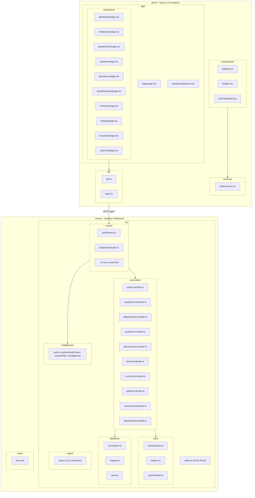
```mermaid
graph TB
    subgraph ClientPackage["client/ - Next.js 16 Frontend"]
        subgraph AppPkg["app/"]
            LoginPage["login/page.tsx"]
            DashboardLayout["(dashboard)/layout.tsx"]
            subgraph DashboardPages["dashboard/"]
                PgDashboard["dashboard/page.tsx"]
                PgEmployees["employees/page.tsx"]
                PgDepartments["departments/page.tsx"]
                PgPositions["positions/page.tsx"]
                PgAttendance["attendance/page.tsx"]
                PgLeave["leaveRequests/page.tsx"]
                PgContracts["contracts/page.tsx"]
                PgSalaries["salaries/page.tsx"]
                PgInsurance["insurance/page.tsx"]
                PgOrgChart["orgChart/page.tsx"]
            end
        end
        subgraph ComponentsPkg["components/"]
            Sidebar["Sidebar.tsx"]
            Header["Header.tsx"]
            RichText["RichTextEditor.tsx"]
        end
        subgraph ContextsPkg["contexts/"]
            AuthCtx["AuthContext.tsx"]
        end
        subgraph LibPkg["lib/"]
            ApiLib["api.ts"]
            TypesLib["types.ts"]
        end
    end

    subgraph ServerPackage["server/ - Express 5 Backend"]
        subgraph SrcPkg["src/"]
            IndexTS["index.ts (Entry Point)"]
            subgraph ControllersPkg["controllers/"]
                AuthCtrl["authController.ts"]
                EmpCtrl["employeeController.ts"]
                DeptCtrl["departmentController.ts"]
                PosCtrl["positionController.ts"]
                AttCtrl["attendanceController.ts"]
                LeaveCtrl["leaveController.ts"]
                ContractCtrl["contractController.ts"]
                SalaryCtrl["salaryController.ts"]
                InsCtrl["insuranceController.ts"]
                DashCtrl["dashboardController.ts"]
            end
            subgraph RoutesPkg["routes/"]
                R1["authRoutes.ts"]
                R2["employeeRoutes.ts"]
                R3["...8 more route files"]
            end
            subgraph MiddlewarePkg["middleware/"]
                AuthMW["auth.ts (authenticateToken, requireRole, canApprove)"]
            end
            subgraph UtilsPkg["utils/"]
                TaxCalc["taxCalculator.ts"]
                Helpers["helpers.ts"]
                ExportHelper["exportHelper.ts"]
            end
            subgraph DatabasePkg["database/"]
                ConnTS["connection.ts"]
                MigrateTS["migrate.ts"]
                SeedTS["seed.ts"]
            end
            subgraph TypesPkg["types/"]
                TypesIdx["index.ts (15 interfaces)"]
            end
        end
        subgraph DataPkg["data/"]
            DBFile["hrms.db"]
        end
    end

    DashboardPages --> LibPkg
    ComponentsPkg --> ContextsPkg
    LibPkg -->|"HTTP /api/*"| RoutesPkg
    RoutesPkg --> MiddlewarePkg
    RoutesPkg --> ControllersPkg
    ControllersPkg --> UtilsPkg
    ControllersPkg --> DatabasePkg
```

---

# 13. Biểu Đồ Tuần Tự (Sequence Diagram)

## 13.1. Đăng Nhập Hệ Thống

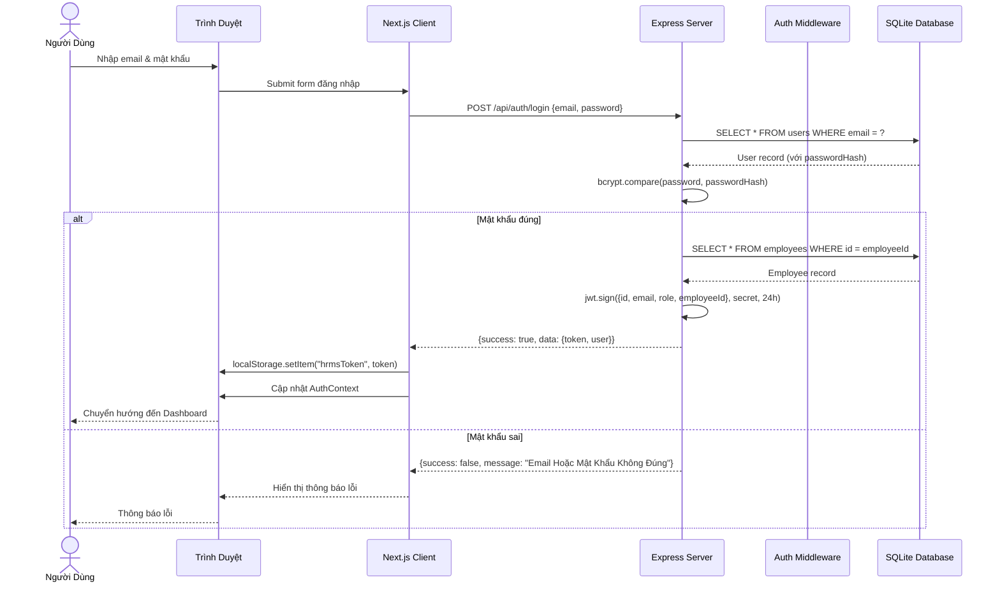
```mermaid
sequenceDiagram
    actor User as Người Dùng
    participant Browser as Trình Duyệt
    participant NextJS as Next.js Client
    participant API as Express Server
    participant Auth as Auth Middleware
    participant DB as SQLite Database

    User->>Browser: Nhập email & mật khẩu
    Browser->>NextJS: Submit form đăng nhập
    NextJS->>API: POST /api/auth/login {email, password}
    API->>DB: SELECT * FROM users WHERE email = ?
    DB-->>API: User record (với passwordHash)
    API->>API: bcrypt.compare(password, passwordHash)
    alt Mật khẩu đúng
        API->>DB: SELECT * FROM employees WHERE id = employeeId
        DB-->>API: Employee record
        API->>API: jwt.sign({id, email, role, employeeId}, secret, 24h)
        API-->>NextJS: {success: true, data: {token, user}}
        NextJS->>Browser: localStorage.setItem("hrmsToken", token)
        NextJS->>Browser: Cập nhật AuthContext
        Browser-->>User: Chuyển hướng đến Dashboard
    else Mật khẩu sai
        API-->>NextJS: {success: false, message: "Email Hoặc Mật Khẩu Không Đúng"}
        NextJS-->>Browser: Hiển thị thông báo lỗi
        Browser-->>User: Thông báo lỗi
    end
```

## 13.2. Chấm Công (Check-in / Check-out)

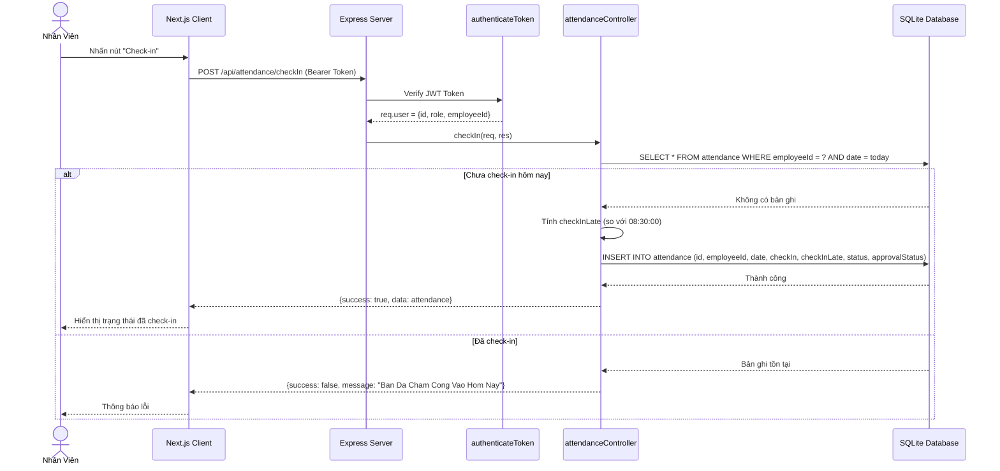
```mermaid
sequenceDiagram
    actor EMP as Nhân Viên
    participant Client as Next.js Client
    participant API as Express Server
    participant Auth as authenticateToken
    participant Ctrl as attendanceController
    participant DB as SQLite Database

    EMP->>Client: Nhấn nút "Check-in"
    Client->>API: POST /api/attendance/checkIn (Bearer Token)
    API->>Auth: Verify JWT Token
    Auth-->>API: req.user = {id, role, employeeId}
    API->>Ctrl: checkIn(req, res)
    Ctrl->>DB: SELECT * FROM attendance WHERE employeeId = ? AND date = today
    alt Chưa check-in hôm nay
        DB-->>Ctrl: Không có bản ghi
        Ctrl->>Ctrl: Tính checkInLate (so với 08:30:00)
        Ctrl->>DB: INSERT INTO attendance (id, employeeId, date, checkIn, checkInLate, status, approvalStatus)
        DB-->>Ctrl: Thành công
        Ctrl-->>Client: {success: true, data: attendance}
        Client-->>EMP: Hiển thị trạng thái đã check-in
    else Đã check-in
        DB-->>Ctrl: Bản ghi tồn tại
        Ctrl-->>Client: {success: false, message: "Ban Da Cham Cong Vao Hom Nay"}
        Client-->>EMP: Thông báo lỗi
    end
```

## 13.3. Duyệt Đơn Xin Nghỉ Phép

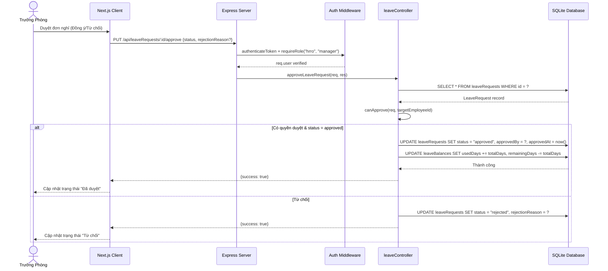
```mermaid
sequenceDiagram
    actor MGR as Trưởng Phòng
    participant Client as Next.js Client
    participant API as Express Server
    participant Auth as Auth Middleware
    participant Ctrl as leaveController
    participant DB as SQLite Database

    MGR->>Client: Duyệt đơn nghỉ (Đồng ý/Từ chối)
    Client->>API: PUT /api/leaveRequests/:id/approve {status, rejectionReason?}
    API->>Auth: authenticateToken + requireRole("hrro", "manager")
    Auth-->>API: req.user verified
    API->>Ctrl: approveLeaveRequest(req, res)
    Ctrl->>DB: SELECT * FROM leaveRequests WHERE id = ?
    DB-->>Ctrl: LeaveRequest record
    Ctrl->>Ctrl: canApprove(req, targetEmployeeId)
    alt Có quyền duyệt & status = approved
        Ctrl->>DB: UPDATE leaveRequests SET status = "approved", approvedBy = ?, approvedAt = now()
        Ctrl->>DB: UPDATE leaveBalances SET usedDays += totalDays, remainingDays -= totalDays
        DB-->>Ctrl: Thành công
        Ctrl-->>Client: {success: true}
        Client-->>MGR: Cập nhật trạng thái "Đã duyệt"
    else Từ chối
        Ctrl->>DB: UPDATE leaveRequests SET status = "rejected", rejectionReason = ?
        Ctrl-->>Client: {success: true}
        Client-->>MGR: Cập nhật trạng thái "Từ chối"
    end
```

---

# 14. Biểu Đồ Hoạt Động (Activity Diagram)

## 14.1. Quy Trình Chấm Công Hàng Ngày

```mermaid
flowchart TD
    Start((" ")) --> Login[Nhan vien dang nhap]
    Login --> CheckPage[Truy cap trang Cham Cong]
    CheckPage --> HasCheckedIn{Da check-in hom nay?}

    HasCheckedIn -->|Chua| ClickCheckIn[Nhan nut Check-in]
    ClickCheckIn --> RecordTime[Ghi nhan gio vao]
    RecordTime --> CompareTime{So sanh voi 08:30}
    CompareTime -->|Truoc 08:30| OnTime[checkInLate = 0]
    CompareTime -->|Sau 08:30| Late[Tinh so phut muon]
    OnTime --> SaveAttendance[Luu ban ghi - approvalStatus: pending]
    Late --> SaveAttendance

    HasCheckedIn -->|Roi| HasCheckedOut{Da check-out?}
    HasCheckedOut -->|Chua| ClickCheckOut[Nhan nut Check-out]
    ClickCheckOut --> RecordOut[Ghi nhan gio ra]
    RecordOut --> CalcHours["Tinh workingHours = (out - in - 60min) / 60"]
    CalcHours --> CompareEnd{So sanh voi 17:30}
    CompareEnd -->|Truoc 17:30| Early[Tinh so phut ve som]
    CompareEnd -->|Sau 17:30| CalcOT[Tinh gio OT]
    Early --> UpdateAttendance[Cap nhat ban ghi]
    CalcOT --> UpdateAttendance

    HasCheckedOut -->|Roi| AlreadyDone[Da hoan tat cham cong]

    SaveAttendance --> WaitApproval[Cho Truong Phong duyet]
    UpdateAttendance --> WaitApproval
    WaitApproval --> ManagerReview{Truong Phong duyet?}
    ManagerReview -->|Dong y| Approved[approvalStatus: approved]
    ManagerReview -->|Tu choi| Rejected[approvalStatus: rejected]
    Approved --> End((" "))
    Rejected --> End
    AlreadyDone --> End

    classDef startEnd fill:#000,stroke:#000,color:#000
    class Start,End startEnd
```

## 14.2. Quy Trình Tính Lương Hàng Tháng

```mermaid
flowchart TD
    Start((" ")) --> SelectMonth[HRMO chon thang, nam]
    SelectMonth --> GetEmployees[Lay tat ca NV active + hop dong active]
    GetEmployees --> LoopStart[Vong lap: tung nhan vien]
    LoopStart --> GetContract[Lay grossSalary tu hop dong]
    GetContract --> GetAttendance[Lay cham cong approved thang do]
    GetAttendance --> CalcWorkDays["Tinh standardWorkingDays = daysInMonth - weekends - holidays"]
    CalcWorkDays --> CalcBasic["basicSalary = grossSalary x (workingDays / standardWorkingDays)"]
    CalcBasic --> AddAllowances[Cong phu cap tu employeeAllowances]
    AddAllowances --> AddOT["Tinh OT = (gross / stdDays / 8) x 1.5 x otHours"]
    AddOT --> CalcGross["Gross = basic + allowances + OT"]
    CalcGross --> CalcInsurance["Tru BHXH 8% + BHYT 1.5% + BHTN 1% (tran 36M)"]
    CalcInsurance --> CalcDeduction["Giam tru gia canh: 11M + 4.4M/nguoi phu thuoc"]
    CalcDeduction --> CalcTaxable["Thu nhap chiu thue = Gross - BH - Giam tru"]
    CalcTaxable --> HasTaxable{Thu nhap chiu thue > 0?}
    HasTaxable -->|Khong| NoTax[Thue TNCN = 0]
    HasTaxable -->|Co| CalcPIT["Tinh thue TNCN luy tien 7 bac (5%-35%)"]
    NoTax --> CalcNet["Net = Gross - Tong BH - Thue TNCN"]
    CalcPIT --> CalcNet
    CalcNet --> SaveSalary["Luu bang luong - status: draft"]
    SaveSalary --> Approve{HRMO duyet?}
    Approve -->|Co| StatusApproved["status: approved"]
    StatusApproved --> Pay{Thanh toan?}
    Pay -->|Co| StatusPaid["status: paid + paidDate"]
    Pay -->|Chua| End((" "))
    Approve -->|Chua| End
    StatusPaid --> End

    classDef startEnd fill:#000,stroke:#000,color:#000
    class Start,End startEnd
```

## 14.3. Quy Trình Xin Nghỉ Phép

```mermaid
flowchart TD
    Start((" ")) --> CreateForm[Nhan vien tao don xin nghi]
    CreateForm --> SelectType[Chon loai nghi tu leaveTypes]
    SelectType --> InputDates[Nhap ngay bat dau va ket thuc]
    InputDates --> InputReason[Nhap ly do chi tiet]
    InputReason --> CalcDays[He thong tinh totalDays]
    CalcDays --> CheckBalance{Kiem tra leaveBalances: du ngay phep?}
    CheckBalance -->|Khong du| RejectCreate[Thong bao: Khong Du Ngay Phep]
    RejectCreate --> End((" "))
    CheckBalance -->|Du| SaveRequest["Luu don - status: pending"]
    SaveRequest --> ManagerNotify[Gui thong bao den Truong Phong]
    ManagerNotify --> ManagerDecision{Truong Phong quyet dinh?}
    ManagerDecision -->|Dong y| UpdateApproved["status: approved"]
    UpdateApproved --> DeductBalance["usedDays += totalDays, remainingDays -= totalDays"]
    DeductBalance --> NotifyEmployee[Thong bao cho nhan vien: Da duyet]
    ManagerDecision -->|Tu choi| UpdateRejected["status: rejected + rejectionReason"]
    UpdateRejected --> NotifyRejected[Thong bao cho nhan vien: Bi tu choi]
    NotifyEmployee --> End
    NotifyRejected --> End

    classDef startEnd fill:#000,stroke:#000,color:#000
    class Start,End startEnd
```

---

# 15. Biểu Đồ Trạng Thái (State Machine Diagram)

## 15.1. Trạng Thái Chấm Công (Attendance)

```mermaid
stateDiagram-v2
    [*] --> CheckedIn : Nhân viên check-in
    CheckedIn --> CheckedOut : Nhân viên check-out
    CheckedOut --> Pending : Tự động chuyển sang chờ duyệt

    state ApprovalStatus {
        Pending --> Approved : Trưởng Phòng đồng ý
        Pending --> Rejected : Trưởng Phòng từ chối
    }

    Approved --> [*]
    Rejected --> [*]
```

## 15.2. Trạng Thái Đơn Xin Nghỉ (Leave Request)

```mermaid
stateDiagram-v2
    [*] --> Pending : Nhân viên tạo đơn

    Pending --> Approved : Trưởng Phòng duyệt
    Pending --> Rejected : Trưởng Phòng từ chối
    Pending --> Cancelled : Nhân viên hủy đơn

    Approved --> [*] : Trừ ngày phép
    Rejected --> [*] : Ghi lý do từ chối
    Cancelled --> [*] : Don chi huy khi dang pending

    note right of Pending : status = "pending"
    note right of Approved : status = "approved"
    note right of Rejected : status = "rejected"
    note right of Cancelled : status = "cancelled"
```

## 15.3. Trạng Thái Hợp Đồng (Contract)

```mermaid
stateDiagram-v2
    [*] --> Draft : HRMO tạo hợp đồng

    Draft --> Active : Ký hợp đồng thành công
    Draft --> Draft : Chỉnh sửa nội dung

    Active --> Expired : Hết hạn hợp đồng
    Active --> Terminated : Chấm dứt hợp đồng

    Expired --> [*]
    Terminated --> [*]

    note right of Draft : Soạn thảo với RichTextEditor
    note right of Active : Đang có hiệu lực
```

## 15.4. Trạng Thái Bảng Lương (Salary)

```mermaid
stateDiagram-v2
    [*] --> Draft : HRMO tính lương tháng

    Draft --> Approved : HRMO duyệt bảng lương
    Approved --> Paid : Xác nhận đã thanh toán

    Paid --> [*] : Ghi nhận paidDate

    note right of Draft : Có thể tính lại
    note right of Approved : Chờ thanh toán
    note right of Paid : Đã chuyển khoản
```

## 15.5. Trạng Thái Nhân Viên (Employment)

```mermaid
stateDiagram-v2
    [*] --> Probation : HRMO tạo nhân viên mới (thử việc)

    Probation --> Active : Đạt thử việc
    Probation --> Terminated : Không đạt thử việc

    Active --> Resigned : Nhân viên nghỉ việc
    Active --> Terminated : Sa thải

    Resigned --> [*]
    Terminated --> [*]

    note right of Active : employmentStatus = "active"
    note right of Probation : employmentStatus = "probation"
```

---

# 16. Biểu Đồ Triển Khai (Deployment Diagram)

```mermaid
graph TB
    subgraph ClientNode["Client Node - localhost:3000"]
        NextServer["Next.js Dev Server"]
        NextApp["React 19 App (SSR + CSR)"]
        StaticAssets["Static Assets (CSS, Favicon)"]
    end

    subgraph ServerNode["Server Node - localhost:3001"]
        ExpressApp["Express 5 Application"]
        JWTModule["JWT Authentication Module"]
        BCryptModule["BCrypt Password Hashing"]
        ExcelModule["ExcelJS Export Module"]
        TaxModule["Vietnam PIT Tax Calculator"]
    end

    subgraph DatabaseNode["Database Node - File System"]
        SQLiteFile["hrms.db (SQLite3 File)"]
        WALFile["hrms.db-wal (WAL Journal)"]
        SHMFile["hrms.db-shm (Shared Memory)"]
    end

    subgraph UserDevice["User Device"]
        Browser["Web Browser (Chrome, Firefox, Edge)"]
        LocalStorage["localStorage (JWT Token)"]
    end

    Browser -->|"HTTP GET/POST (Port 3000)"| NextServer
    NextServer -->|"Rewrite Proxy /api/*"| ExpressApp
    ExpressApp -->|"better-sqlite3 (Synchronous I/O)"| SQLiteFile
    Browser --> LocalStorage

    subgraph Dependencies["Dependencies"]
        direction LR
        NodeJS["Node.js Runtime"]
        NPM["npm Package Manager"]
        TSX["tsx (TypeScript Executor)"]
    end

    NextServer --> NodeJS
    ExpressApp --> NodeJS
```

### Cấu hình triển khai

| Thành phần | Chi tiết |
|---|---|
| **Client Port** | `localhost:3000` (Next.js Dev Server) |
| **Server Port** | `localhost:3001` (Express Server) |
| **API Proxy** | Next.js `rewrites()`: `/api/*` → `http://localhost:3001/api/*` |
| **CORS** | Cho phép origin `http://localhost:3000`, credentials: true |
| **Database** | File: `server/data/hrms.db` |
| **JSON Limit** | Request body tối đa 10MB |
| **JWT Expiry** | 24 giờ |

---

# 17. Công Nghệ Sử Dụng

## 17.1. Frontend (Client)

| Công nghệ | Phiên bản | Vai trò |
|---|---|---|
| **Next.js** | 16.1.6 | Framework React full-stack, App Router, SSR |
| **React** | 19.2.4 | Thư viện UI component-based |
| **TypeScript** | 5.x | Ngôn ngữ type-safe |
| **Tailwind CSS** | 4.x | Utility-first CSS framework |
| **Recharts** | 3.7.0 | Thư viện biểu đồ thống kê (Pie, Bar, Line) |
| **TipTap** | 3.18.0 | Rich text editor cho soạn thảo hợp đồng |
| **Lucide React** | 0.563.0 | Bộ icon SVG hiện đại |

## 17.2. Backend (Server)

| Công nghệ | Phiên bản | Vai trò |
|---|---|---|
| **Express** | 5.2.1 | Web framework REST API |
| **TypeScript** | 5.9.3 | Ngôn ngữ type-safe |
| **better-sqlite3** | 12.6.2 | SQLite driver (synchronous, high-performance) |
| **jsonwebtoken** | 9.0.3 | JWT authentication |
| **bcryptjs** | 3.0.3 | Hash mật khẩu |
| **ExcelJS** | 4.4.0 | Xuất file Excel (.xlsx) |
| **uuid** | 13.0.0 | Tạo ID duy nhất (UUIDv4) |
| **cors** | 2.8.6 | Cross-Origin Resource Sharing |
| **tsx** | 4.21.0 | TypeScript executor (hot reload dev) |

## 17.3. Database

| Công nghệ | Mô tả |
|---|---|
| **SQLite3** | CSDL nhúng, serverless, zero-configuration |
| **WAL Mode** | Write-Ahead Logging cho hiệu năng đọc/ghi |
| **Foreign Keys** | Ràng buộc tham chiếu giữa các bảng |

---

# 18. Kết Quả Đạt Được

## 18.1. Các chức năng đã hoàn thành

| STT | Module | Chức năng | Trạng thái |
|---|---|---|---|
| 1 | Xác thực | Đăng nhập JWT, phân quyền 3 cấp RBAC | ✅ Hoàn thành |
| 2 | Nhân viên | CRUD 29 trường, tìm kiếm, phân trang, sắp xếp, xuất Excel | ✅ Hoàn thành |
| 3 | Phòng ban | CRUD phòng ban phân cấp, gán trưởng phòng | ✅ Hoàn thành |
| 4 | Vị trí | CRUD chức danh, mức lương cơ bản | ✅ Hoàn thành |
| 5 | Chấm công | Check-in/out, tính muộn/sớm, duyệt, xuất Excel | ✅ Hoàn thành |
| 6 | Nghỉ phép | Tạo/duyệt/hủy đơn, quản lý ngày phép, xuất Excel | ✅ Hoàn thành |
| 7 | Hợp đồng | CRUD với rich text editor TipTap | ✅ Hoàn thành |
| 8 | Lương | Tính lương tự động theo thuế TNCN 7 bậc, duyệt, thanh toán, xuất Excel | ✅ Hoàn thành |
| 9 | Bảo hiểm | Quản lý BHXH/BHYT/BHTN, mức trần 36M | ✅ Hoàn thành |
| 10 | Dashboard | 7 chỉ số KPI + 5 biểu đồ Recharts | ✅ Hoàn thành |
| 11 | Sơ đồ tổ chức | Hiển thị cây tổ chức phòng ban | ✅ Hoàn thành |
| 12 | Xuất dữ liệu | Export Excel cho nhân viên, chấm công, nghỉ phép, lương | ✅ Hoàn thành |

## 18.2. Biểu đồ Dashboard

| STT | Biểu đồ | Loại | Dữ liệu |
|---|---|---|---|
| 1 | Trạng thái nhân viên | Pie Chart | Active / Probation / Terminated / Resigned |
| 2 | Phân bố theo phòng ban | Bar Chart | Số nhân viên active mỗi phòng ban |
| 3 | Chấm công hàng tháng | Line Chart | Tổng lượt chấm công approved theo 12 tháng |
| 4 | Thống kê nghỉ phép | Bar Chart | Tổng ngày nghỉ theo loại |
| 5 | Xu hướng tuyển dụng | Line Chart | Số nhân viên mới theo 12 tháng |

## 18.3. Phân quyền chi tiết

| Tính năng | HRMO | Trưởng Phòng | Nhân Viên |
|---|---|---|---|
| Dashboard thống kê | ✅ Toàn hệ thống | ✅ Dữ liệu phòng ban | ✅ Dữ liệu cá nhân |
| CRUD Nhân viên | ✅ Tất cả | ❌ | ❌ |
| CRUD Phòng ban | ✅ | ❌ | ❌ |
| CRUD Vị trí | ✅ | ❌ | ❌ |
| Chấm công | ✅ CRUD + Duyệt Manager | ✅ Check-in/out + Duyệt team + Xuất Excel | ✅ Check-in/out cá nhân |
| Đơn nghỉ phép | ✅ CRUD + Duyệt Manager | ✅ Tạo + Duyệt team + Xuất Excel | ✅ Tạo/Hủy cá nhân |
| Hợp đồng | ✅ CRUD + Xuất Excel | ✅ Xem team | ✅ Xem cá nhân |
| Bảng lương | ✅ Tính + Duyệt + Thanh toán + Xuất Excel | ✅ Xem team | ✅ Xem cá nhân |
| Bảo hiểm | ✅ CRUD + Xuất Excel | ❌ | ❌ |
| Sơ đồ tổ chức | ✅ | ✅ | ✅ |
| Xuất Excel NV | ✅ | ❌ | ❌ |

## 18.4. API Endpoints

| Module | Method | Endpoint | Mô tả |
|---|---|---|---|
| Auth | POST | `/api/auth/login` | Đăng nhập |
| Auth | GET | `/api/auth/profile` | Lấy thông tin user đang đăng nhập |
| Employees | GET | `/api/employees` | Danh sách nhân viên (phân trang, tìm kiếm) |
| Employees | GET | `/api/employees/orgchart` | Sơ đồ tổ chức |
| Employees | GET | `/api/employees/managers` | Danh sách quản lý |
| Employees | GET | `/api/employees/export` | Xuất Excel (HRMO) |
| Employees | POST | `/api/employees` | Thêm nhân viên mới (HRMO) |
| Employees | PUT | `/api/employees/:id` | Cập nhật nhân viên (HRMO) |
| Employees | DELETE | `/api/employees/:id` | Xóa nhân viên (HRMO) |
| Departments | GET | `/api/departments` | Danh sách phòng ban (phân trang) |
| Departments | GET | `/api/departments/all` | Tất cả phòng ban (không phân trang) |
| Departments | POST | `/api/departments` | Thêm phòng ban (HRMO) |
| Departments | PUT | `/api/departments/:id` | Cập nhật phòng ban (HRMO) |
| Departments | DELETE | `/api/departments/:id` | Xóa phòng ban (HRMO) |
| Positions | GET | `/api/positions` | Danh sách vị trí (phân trang) |
| Positions | GET | `/api/positions/all` | Tất cả vị trí (không phân trang) |
| Positions | POST | `/api/positions` | Thêm vị trí (HRMO) |
| Positions | PUT | `/api/positions/:id` | Cập nhật vị trí (HRMO) |
| Positions | DELETE | `/api/positions/:id` | Xóa vị trí (HRMO) |
| Attendance | GET | `/api/attendance` | Danh sách chấm công (phân trang) |
| Attendance | GET | `/api/attendance/today` | Chấm công hôm nay |
| Attendance | GET | `/api/attendance/export` | Xuất Excel (HRMO, Manager) |
| Attendance | POST | `/api/attendance/checkIn` | Chấm công vào |
| Attendance | POST | `/api/attendance/checkOut` | Chấm công ra |
| Attendance | PUT | `/api/attendance/:id/approve` | Duyệt chấm công (HRMO, Manager) |
| Leave | GET | `/api/leaveRequests` | Danh sách đơn nghỉ (phân trang) |
| Leave | GET | `/api/leaveRequests/types` | Danh sách loại nghỉ phép |
| Leave | GET | `/api/leaveRequests/balance` | Số ngày phép còn lại |
| Leave | GET | `/api/leaveRequests/export` | Xuất Excel (HRMO, Manager) |
| Leave | POST | `/api/leaveRequests` | Tạo đơn nghỉ mới |
| Leave | PUT | `/api/leaveRequests/:id/approve` | Duyệt đơn nghỉ (HRMO, Manager) |
| Leave | PUT | `/api/leaveRequests/:id/cancel` | Hủy đơn nghỉ |
| Leave | DELETE | `/api/leaveRequests/:id` | Xóa đơn nghỉ (HRMO) |
| Contracts | GET | `/api/contracts` | Danh sách hợp đồng (phân trang) |
| Contracts | GET | `/api/contracts/export` | Xuất Excel (HRMO) |
| Contracts | POST | `/api/contracts` | Tạo hợp đồng (HRMO) |
| Contracts | PUT | `/api/contracts/:id` | Cập nhật hợp đồng (HRMO) |
| Contracts | PUT | `/api/contracts/:id/activate` | Kích hoạt hợp đồng (HRMO) |
| Contracts | DELETE | `/api/contracts/:id` | Xóa hợp đồng (HRMO) |
| Salary | GET | `/api/salaries` | Danh sách bảng lương (phân trang) |
| Salary | GET | `/api/salaries/export` | Xuất Excel (HRMO) |
| Salary | POST | `/api/salaries/calculate` | Tính lương tháng (HRMO) |
| Salary | PUT | `/api/salaries/:id/approve` | Duyệt bảng lương (HRMO) |
| Salary | PUT | `/api/salaries/:id/pay` | Xác nhận thanh toán (HRMO) |
| Insurance | GET | `/api/insurance` | Danh sách bảo hiểm (HRMO) |
| Insurance | GET | `/api/insurance/export` | Xuất Excel (HRMO) |
| Insurance | POST | `/api/insurance` | Đăng ký bảo hiểm (HRMO) |
| Insurance | PUT | `/api/insurance/:id` | Cập nhật bảo hiểm (HRMO) |
| Insurance | DELETE | `/api/insurance/:id` | Xóa bảo hiểm (HRMO) |
| Dashboard | GET | `/api/dashboard/stats` | Thống kê tổng quan |
| Dashboard | GET | `/api/dashboard/employeesByDepartment` | Biểu đồ phòng ban |
| Dashboard | GET | `/api/dashboard/employeeStatus` | Biểu đồ trạng thái |
| Dashboard | GET | `/api/dashboard/monthlyAttendance` | Biểu đồ chấm công |
| Dashboard | GET | `/api/dashboard/leaveStatistics` | Biểu đồ nghỉ phép |
| Dashboard | GET | `/api/dashboard/hiringTrends` | Biểu đồ tuyển dụng |
| Health | GET | `/api/health` | Kiểm tra trạng thái server |

---

# 19. Tổng Kết

## 19.1. Kết quả đạt được

Bài tập lớn đã xây dựng thành công **Hệ Thống Quản Lý Nhân Sự Doanh Nghiệp (HRMS)** — một ứng dụng web full-stack hoàn chỉnh với các thành tựu chính:

1. **Kiến trúc hiện đại**: Ứng dụng Client-Server với Next.js 16 (Frontend) và Express 5 (Backend), giao tiếp qua RESTful API, sử dụng TypeScript type-safe toàn bộ.

2. **Cơ sở dữ liệu hoàn chỉnh**: 17 bảng SQLite với quan hệ ràng buộc rõ ràng, 7 indexes tối ưu hiệu năng, sử dụng WAL mode cho đọc/ghi đồng thời.

3. **Nghiệp vụ HR đầy đủ**: 12 module chức năng bao phủ toàn bộ quy trình nhân sự — từ quản lý hồ sơ, chấm công, nghỉ phép, hợp đồng, đến tính lương theo biểu thuế TNCN lũy tiến 7 bậc của Việt Nam.

4. **Bảo mật & Phân quyền**: JWT authentication, bcrypt password hashing, RBAC 3 cấp (HRMO, Trưởng Phòng, Nhân Viên) với kiểm tra quyền duyệt chi tiết.

5. **Giao diện chuyên nghiệp**: Dashboard trực quan với 5 biểu đồ Recharts, rich text editor TipTap cho soạn hợp đồng, xuất Excel bằng ExcelJS, giao diện tiếng Việt.

## 19.2. Bài học kinh nghiệm

- **Thiết kế trước, code sau**: Việc phân tích yêu cầu và thiết kế UML kỹ lưỡng (Use Case, Class, ERD, Sequence, Activity, State Machine) giúp quá trình lập trình nhanh hơn và ít lỗi hơn.
- **TypeScript là bắt buộc**: Type-safe giúp phát hiện lỗi sớm, cải thiện chất lượng code đáng kể.
- **SQLite phù hợp doanh nghiệp vừa**: Với WAL mode và better-sqlite3, SQLite đủ hiệu năng cho ứng dụng web có quy mô vừa phải mà không cần cài đặt database server riêng.

## 19.3. Hướng phát triển

- Tích hợp thông báo real-time bằng WebSocket.
- Thêm module quản lý đào tạo và KPI nhân viên.
- Hỗ trợ đăng nhập bằng SSO (Google, Microsoft).
- Triển khai ứng dụng mobile (React Native).
- Chuyển sang PostgreSQL cho quy mô lớn hơn.
- Thêm module báo cáo nâng cao với xuất PDF.

---

# 20. Tài Liệu Tham Khảo

1. Next.js Documentation - https://nextjs.org/docs
2. Express.js Documentation - https://expressjs.com/
3. React Documentation - https://react.dev/
4. TypeScript Handbook - https://www.typescriptlang.org/docs/
5. SQLite Documentation - https://www.sqlite.org/docs.html
6. better-sqlite3 API - https://github.com/WiseLibs/better-sqlite3
7. Recharts Documentation - https://recharts.org/
8. TipTap Editor - https://tiptap.dev/
9. Tailwind CSS - https://tailwindcss.com/docs
10. JSON Web Tokens - https://jwt.io/
11. Luật Thuế Thu Nhập Cá Nhân Việt Nam - Biểu thuế lũy tiến từng phần (Điều 22, Luật Thuế TNCN)
12. Luật Bảo Hiểm Xã Hội Việt Nam - Mức đóng BHXH, BHYT, BHTN
13. Lucide Icons - https://lucide.dev/
14. ExcelJS - https://github.com/exceljs/exceljs
15. UML Diagrams - Unified Modeling Language Specification (OMG)
